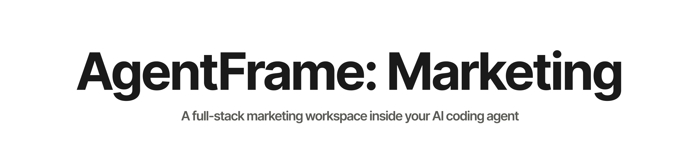
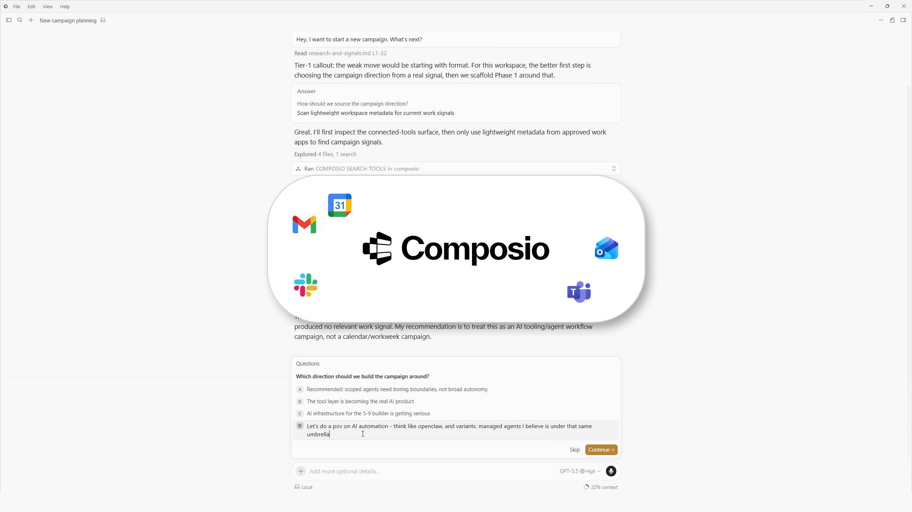
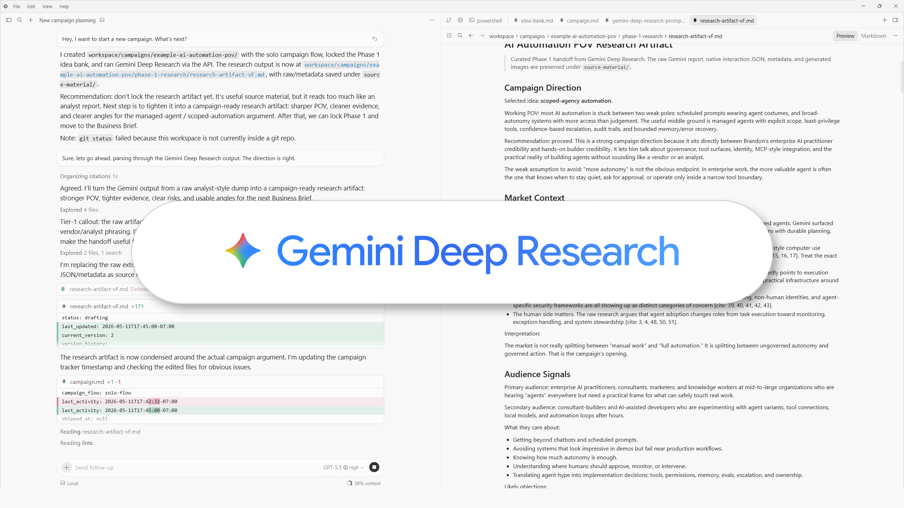
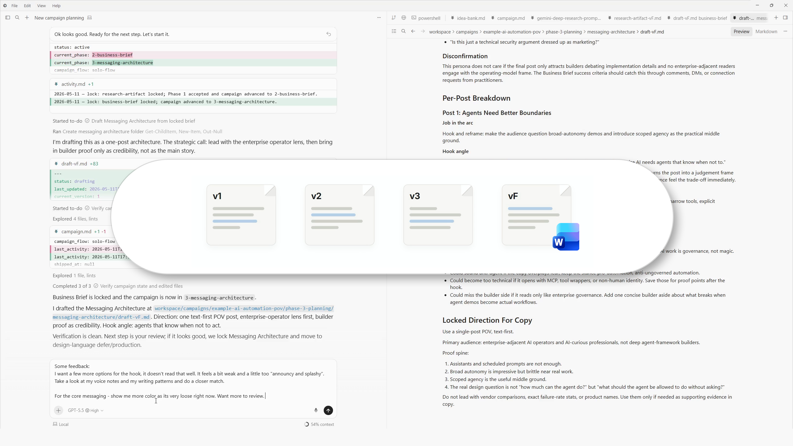
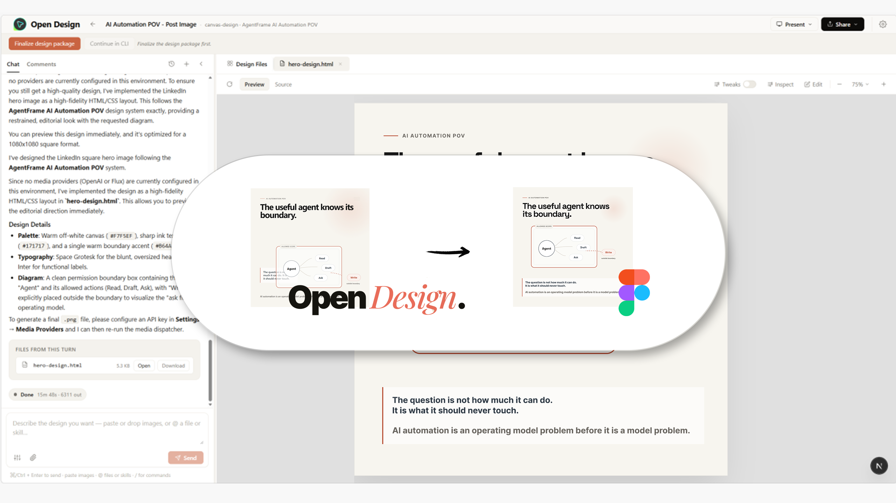
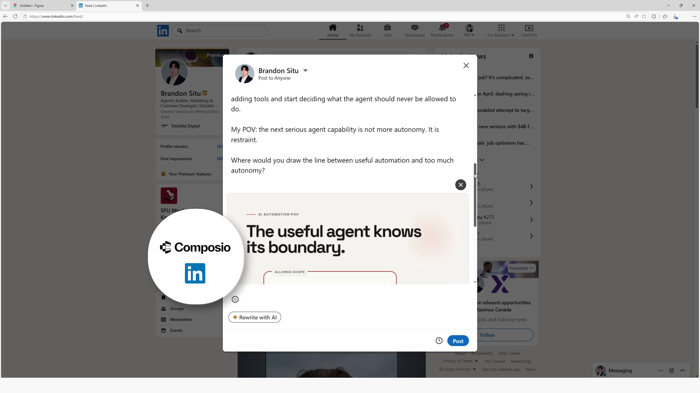
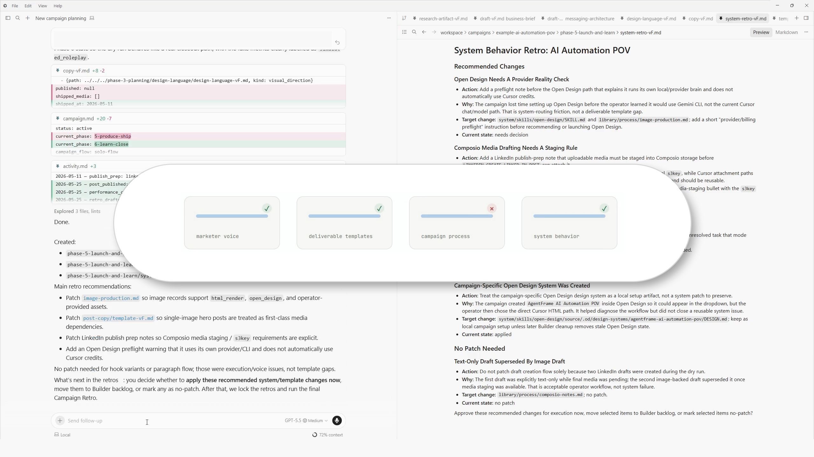

# AgentFrame: Marketing

<p align="center">
  
</p>

> **A full-stack marketing workspace inside your AI coding agent.** File-native. Built for solo operators. Evolves with your workflow. Two `AGENTS.md` modes carry the work — **CMO** ships campaigns, **Builder** evolves the system. Plan a campaign and publish your first post in an hour, without leaving your IDE.

<p align="center">
  <a href="LICENSE"></a>
  
  
</p>

https://github.com/user-attachments/assets/73c6ce7f-cfd8-4457-8cf0-e1a979094e6e


**Jump to:** [Quick start](#quick-start) · [Why](#why-this-exists) · [Walkthrough](#a-real-campaign-step-by-step) · [Architecture](#architecture) · [Roadmap](#roadmap)


## Table of contents

- [Quick start](#quick-start)
- [Why this exists](#why-this-exists)
- [A real campaign, step by step](#a-real-campaign-step-by-step)
- [At a glance](#at-a-glance)
- [Six architectural principles](#six-architectural-principles)
- [Recommended connectors](#recommended-connectors)
- [Architecture](#architecture)
- [Repository structure](#repository-structure)
- [Customizability](#customizability)
- [Preview server](#preview-server)
- [Auditability and state](#auditability-and-state)
- [Roadmap](#roadmap)
- [Status](#status)
- [Contributing](#contributing)
- [References and lineage](#references-and-lineage)
- [License](#license)
- [Contact](#contact)


## Quick start

1. **Clone the repo:**

   ```bash
   git clone https://github.com/situhacks/agentframe-marketing.git
   cd agentframe-marketing
   ```

2. **Open the folder in your coding agent** — Claude Code, Codex, Cursor, VS Code, Antigravity, anything that respects `AGENTS.md`.

3. **Setup.** Copy `.env.example` to `.env` and drop in optional connector keys for Gemini and Composio (both have generous free tiers and are optional — the system still runs without them, you just lose Deep Research and direct publishing). If you plan to use Open Design locally, run `corepack pnpm install` inside `system/skills/open-design/source/`.

4. **Start your first campaign.** Tell the agent **"Start a new campaign"** and run it end-to-end.

### Mode swaps

AgentFrame ships with two `AGENTS.md` modes. You swap depending on what you're doing:

- **Swap to CMO when you're running a campaign** — drafting copy, generating images, publishing, doing a retro. CMO is scoped to `workspace/campaigns/` so it can't accidentally edit your templates or processes mid-campaign.
- **Swap to Builder when you're improving the system itself** — editing a template, adding a process, swapping a skill, applying retro patches. Builder is scoped to `system/` and `library/`.

You don't run shell commands by hand. Just tell the agent `swap to Builder` or `swap to CMO`. It handles the file swap and logs the transition to the audit DB.

[Back to top](#agentframe-marketing)


## Why this exists

I used to run my marketing campaigns out of Claude Code. For a while I tried doing it all in chat sessions: write the post here, paste the voice rules there, ask for a rewrite, lose the thread, start over tomorrow. It works for something small, but for multi-post campaigns, things get lost and context starts to degrade. The voice rules I'd "saved" were forgotten by next session. State lived in scrollback. I spent more time retyping my instructions than I wanted.

I looked around for alternatives. What I found was prompt wrappers sitting on top of the same models I'm already paying for, and marketing repos with horrible token efficiency — one of them burned through my whole session before the first post was even done.

I didn't like what I saw. So I built my ideal system myself.

**AgentFrame Marketing** is a file-native marketing workspace that sits inside the coding agent I already use. Two `AGENTS.md` modes carry the work — **CMO** ships campaigns, **Builder** evolves the system. Campaign state lives in markdown files under `workspace/campaigns/`. Voice rules, templates, and processes live in `library/`. Skills and connectors are swappable; when something sharper ships, I replace the skill and the system keeps working. See the [walkthrough below](#a-real-campaign-step-by-step) for what an end-to-end campaign actually looks like.

I've been dogfooding AgentFrame for a while and it's gone through multiple major revisions. The repo evolves with my workflow, not on a release schedule. It's free to fork — take what's useful.

**Stands on the shoulders of:**

- **[Composio](https://composio.dev/)** — all-in-one MCP hub. One connection exposes 100+ workplace and publishing tools (Gmail, Calendar, Drive, LinkedIn, X, Instagram, TikTok, etc.) instead of installing a separate MCP server for each.
- **[Gemini Deep Research](https://gemini.google/us/overview/deep-research/?hl=en)** — detailed research artifacts at campaign start. Runs through the Gemini API so it doesn't burn coding-agent session credits.
- **[Gemini image generation](https://ai.google.dev/gemini-api/docs/image-generation)** (Nano Banana 2 / Pro) — raster image generation, fast variants and high-fidelity hero visuals.
- **[nexu-io/open-design](https://github.com/nexu-io/open-design)** — local-first runtime for images, decks, and template-style visual work. AgentFrame stages the handoff by setting up the project, first prompt and design language; OD owns the generation UI and exports.
- **[heygen-com/hyperframes](https://github.com/heygen-com/hyperframes)** — HTML-to-video composition for motion deliverables.
- **[blader/humanizer](https://github.com/blader/humanizer)** — copy humanization pass before lock.

[Back to top](#agentframe-marketing)


## A real campaign, step by step

A solo-flow walkthrough using the example campaign at `workspace/campaigns/example-ai-automation-pov/`. One operator, six moves, no team handoffs.

<table>
<tr>
<td width="50%" valign="top">
<br/>
<sub><b>01 · CMO kickoff</b> — Tell your coding agent <code>start a new campaign</code>. CMO reads your operator profile, scaffolds the campaign folder, and calls Composio to pull workplace context — recent emails, meeting notes, doc activity — so the campaign starts from what you actually care about that week, not a cold prompt.</sub>
</td>
<td width="50%" valign="top">
<br/>
<sub><b>02 · Gemini Deep Research</b> — Deep Research runs against your chosen direction and lands a structured artifact at <code>phase-1-research/research-artifact-v{N}.md</code>.</sub>
</td>
</tr>
<tr>
<td width="50%" valign="top">
<br/>
<sub><b>03 · Post copy in your voice</b> — Drafts inherit your locked voice rules from <code>library/context/operator/voice.md</code>, then run through the humanizer skill before lock to strip AI tells. Every revision snapshots into <code>version_history</code> so you can roll back, compare, or read why the copy changed.</sub>
</td>
<td width="50%" valign="top">
<br/>
<sub><b>04 · Media creation, your pick</b> — Pick the path that fits the deliverable: HTML render in your coding agent for slide-shaped visuals, Gemini Nano Banana 2/Pro for raster image variants, Open Design for higher-fidelity decks and carousels, or HyperFrames for HTML-to-video. For Open Design specifically, AgentFrame stages the project for you — design language, selected mode, and first prompt already loaded. Just open it and press send. (I usually take the OD export into Figma to clean it up. Optional — most people finish inside OD and ship.)</sub>
</td>
</tr>
<tr>
<td width="50%" valign="top">
<br/>
<sub><b>05 · Published via Composio</b> — Composio's connector to LinkedIn (or X, Instagram, TikTok) sends or schedules the post. Live URL and shipped frontmatter land back in the post folder.</sub>
</td>
<td width="50%" valign="top">
<br/>
<sub><b>06 · Retro</b> — The agent suggests patches to voice rules, templates, processes, and skill behavior based on what actually happened during the run. You approve or reject each one. AgentFrame tracks the small details throughout the campaign so you don't have to remember them.</sub>
</td>
</tr>
</table>


[Back to top](#agentframe-marketing)


## At a glance


In the box: **11 deliverable templates**, **13 process files**, **11 skill bundles**, **2 campaign flows**, a two-mode persona model, a local preview server, and a two-layer audit trail (`activity.md` + SQLite DB).


### Campaign flows

Add or edit any flow under `library/process/campaign-flows/` to match how you actually ship.

| Flow | Purpose |
| --- | --- |
| `solo-flow` (default) | Lightweight campaign workflow for one operator moving fast |
| `open-flow` | Flexible build-as-you-go workflow where the operator sets the deliverables and tempo interactively |
| `standard-flow` | Heavier flow with broader deliverable coverage and more review gates — closer to an enterprise-style campaign |


### Deliverable templates

Edit, duplicate, or add new deliverable types under `library/deliverables/`.


| Template | Output |
| --- | --- |
| `business-brief` | Business context and objective framing |
| `research-artifact` | Research synthesis with sources and implications |
| `messaging-architecture` | Core message map and audience framing |
| `design-language` | Visual and style direction |
| `campaign-brief` | Campaign-level strategy and constraints |
| `post-copy` | Platform-ready post copy |
| `carousel-spec` | Slide-by-slide carousel plan |
| `video-spec` | Video concept, scenes, and production plan |
| `campaign-retro` | Campaign-level learnings and improvements |
| `template-retro` | Template quality review and updates |
| `system-retro` | System-level process and architecture improvements |


### Process files

Process files load on demand — only when the workflow they describe is in play. They stay out of context until they're needed.


| Process | Purpose |
| --- | --- |
| `campaign-flow-authoring` | How to design or evolve campaign flows |
| `process-authoring` | How to design or evolve process files |
| `video-production` | Video workflow from spec to renders |
| `image-production` | Image generation workflow |
| `preview-server` | When and how to use the local preview hub |
| `lock-event` | Lock-state transitions and quality gates |
| `humanizer-integration` | Humanization pass integration |
| `campaign-frontmatter` | Frontmatter schema and state handling |
| `browser-fallback` | Browser automation fallback strategy |
| `composio-notes` | Connector usage notes and caveats |
| `voice-mini-retro` | Lightweight voice quality feedback loop |
| `deliverable-versioning` | Surgical-vs-replacement rule and version-bump procedure for `*-v{N}.md` deliverables |
| `research-and-signals` | Shared kickoff for campaign research: workspace-context definition, live MCP scan, research-method offer |


### Skills

My current production stack. Swap any of them for a sharper tool without touching templates or processes.


| Skill | Source |
| --- | --- |
| `agentframe-structure` | Project skill |
| `deliverable-scaffolding` | Project skill |
| `system-improvement` | Project skill |
| `docx` | Project skill |
| `pptx` | Project skill |
| `humanizer` | Vendored from [blader/humanizer](https://github.com/blader/humanizer) |
| `hyperframes` | Vendored from [heygen-com/hyperframes](https://github.com/heygen-com/hyperframes) |
| `hyperframes-cli` | Vendored from [heygen-com/hyperframes](https://github.com/heygen-com/hyperframes) |
| `gsap` | Vendored animation skill for HyperFrames workflows |
| `open-design` | Vendored local-first runtime from [nexu-io/open-design](https://github.com/nexu-io/open-design) for image/deck/template-style visual production, with AgentFrame setup, staging, and lock-time import rules in `system/skills/open-design/SKILL.md` |
| `browser-harness` | Vendored from [browser-use/browser-harness](https://github.com/browser-use/browser-harness) for CDP-driven browser workflows; routed through Edge with AgentFrame boundary notes in `system/skills/browser-harness/AGENTS.md` |


### Everything else that ships in the box

- Two-mode routing via `AGENTS.cmo.md` and `AGENTS.builder.md`
- YAML frontmatter and campaign artifacts under `workspace/campaigns/`
- `activity.md` per campaign for human-readable history, plus an append-only SQLite audit DB at `system/audit/agentframe.db`
- Local preview server at `system/server/` for HTML, image, video, PDF, PPTX, and DOCX previews
- Browser harness at `system/browser/` using browser-use, with documented fallbacks when a workflow needs a hand-driven Chromium session


[Back to top](#agentframe-marketing)


## Six architectural principles


### P1 — File-native state

Campaign state lives in markdown files: frontmatter, deliverables, `activity.md`. Not in a chat window. Change models, change machines, come back next week — the campaign picks up where it left off.

### P2 — Token efficiency at its core

I designed AgentFrame so context loads only when it's needed, not all at once. `AGENTS.md` is the only always-on router. Flows, processes, templates, and skills are pulled in on demand based on the task — most of the time you're working with a small, focused context. That means longer sessions before hitting limits, fewer tokens burned per campaign, and less of the "agent forgets what we were doing" drift you get when the whole library is loaded upfront.

### P3 — The library is the product

Templates, processes, campaign flows, and personas are the durable layer — they capture how you actually run campaigns and they improve over time. Skills and connectors (Composio, Gemini, Open Design, HyperFrames) are swappable. Replace a skill when something sharper ships; the campaign system is untouched.

### P4 — Two modes, one operator

CMO ships campaigns. Builder evolves the system. The split means CMO can't accidentally edit `library/` mid-campaign, and Builder can't accidentally touch a locked deliverable mid-refactor.

### P5 — Retros patch the system

Every campaign ends with a retro. The agent surfaces specific patches to templates, processes, and skill behavior based on what actually happened, and you approve them. The library evolves campaign by campaign.

### P6 — Auditable and traceable

Two layers capture history:

- `activity.md` per campaign for the human-readable timeline.
- Append-only SQLite audit DB at `system/audit/agentframe.db` for system events (`mode_swap`, `system_changes`, retro outcomes).

Useful when you want to reconstruct what happened, time how long a phase took, or trace why a template changed.


[Back to top](#agentframe-marketing)


## Recommended connectors


External services AgentFrame integrates with. Recommended for the full loop, but all optional — both Gemini and Composio have generous free tiers, and the system still runs campaigns without any of them. You just lose the automation each connector provides.

### Gemini Deep Research

- Deep research artifacts at campaign start — sources, implications, audience signals — saved as structured markdown under `phase-1-research/`.
- Free credits from [Google AI Studio](https://aistudio.google.com) cover solo-operator usage.
- Key: `GEMINI_API_KEY`.

### Gemini image generation (Nano Banana 2 / Pro)

- Fast A/B/C variants for standard illustrations (Nano Banana 2: `gemini-3.1-flash-image-preview`).
- High-fidelity hero and text-in-image visuals (Nano Banana Pro: `gemini-3-pro-image-preview`).
- Routed through `system/server/lib/image_generate.py`; per-post records save as `image-prompt-v{N}.md`.
- Shares the same `GEMINI_API_KEY` as Deep Research.

### Composio

- All-in-one MCP hub. One connection exposes 100+ tools (Gmail, Calendar, Drive, LinkedIn, X, Instagram, TikTok, etc.) instead of installing a separate MCP server for each.
- Workplace signal collection (email, calendar, docs, notes) feeds campaign research and retros.
- Publishing — schedule or send directly to LinkedIn, X, Instagram, TikTok, and others.
- Analytics pullback to feed performance data into campaign retros.
- Get started at [composio.dev](https://composio.dev).

### Open Design

- Bundled local-first visual runtime at `system/skills/open-design/source/`.
- Used for higher-fidelity images, carousels, decks, and template-style visual work.
- Fresh clones may need runtime dependency setup (`corepack`, `pnpm install`, Node 24). Not a separate Open Design product install.
- Uses a local code-agent CLI on `PATH` (Claude Code, Codex, Gemini CLI, etc.), or BYOK provider keys as a fallback.
- AgentFrame stages the handoff through the OD daemon API: campaign design system, selected OD mode/skill, project creation, and the first unsent prompt.
- Operator flow: open the prepared OD project, press Send, revise or export inside OD, then bring the locked asset back into the campaign.

### `.env` shape

```bash
GEMINI_API_KEY=
COMPOSIO_API_KEY=
COMPOSIO_MCP_URL=https://connect.composio.dev/mcp
```

Your coding agent provides the LLM. These keys power the non-LLM tools (research generation, image generation, publishing).


[Back to top](#agentframe-marketing)


## Architecture


### Mode boundary


```text
                                  ┌─── owns ──▶  workspace/campaigns
                  ┌──── CMO ─────┤
                  │              └─── reads ─▶  system + library
   Operator ──────┤
                  │              ┌─── owns ──▶  system + library
                  └─── Builder ──┤
                                 └─── reads ──▶  workspace/campaigns

   ── swap AGENTS.md to flip between modes ──
```


### Load path for a task


```text
   AGENTS.md
       │
       ▼
   campaign-flow
       │
       ▼
   process file ──────────────┐
       │                      │
       ├──▶ deliverable template
       │         │
       │         ▼
       │     campaign artifact
       │         │
       │         ▼
       │     activity.md
       │
       ├──▶ skill
       │
       └──▶ audit DB
```


### File-memory data flow


```text
                          ┌──▶ artifact frontmatter ──┐
                          │                           │
                          ├──▶ deliverable markdown ──┤
   Operator Input ──▶ Agent                           │
   (CMO or Builder)       ├──▶ activity.md ───────────┤
                          │                           │
                          └──▶ audit writer ──▶ audit DB
                                                      │
                                                      ▼
                                              Retro deliverables
                                                      │
                                                      ▼
                                       Template / process / skill patches
                                              (library evolves)
```


Architecture summary:


- `AGENTS.md` is the only always-on router.

- Everything else is loaded on demand to preserve context efficiency.

- Campaign state and outputs live in files; system events are append-only in SQLite.


[Back to top](#agentframe-marketing)


## Repository structure


```text
agentframe-marketing/
├── AGENTS.md
├── AGENTS.cmo.md
├── AGENTS.builder.md
├── README.md
├── .env.example
├── library/
│   ├── deliverables/
│   ├── process/
│   │   └── campaign-flows/
│   └── context/operator.example/
├── system/
│   ├── skills/
│   ├── server/
│   ├── audit/
│   ├── browser/
│   └── builder-backlog.md
└── workspace/
    └── campaigns/
        └── example-ai-automation-pov/
```


[Back to top](#agentframe-marketing)


## Customizability


Everything in the library and skills layer is meant to be edited:

- Add or evolve templates under `library/deliverables/`
- Add or evolve processes under `library/process/`
- Swap skill bundles under `system/skills/`
- Set voice and positioning once in `library/context/operator/` (copy from `operator.example/` on first run), reuse everywhere

Open Design is a concrete example of the swap pattern. AgentFrame owns campaign state, templates, and the staged handoff. Open Design owns generation, revisions, and exports. Locked OD assets return to the calling deliverable's `visuals/imports/` folder.


[Back to top](#agentframe-marketing)


## Preview server

<details>
<summary>Show preview server details</summary>

- Local preview hub at `system/server/`
- Previews HTML, images, video, PDF, PPTX, and DOCX
- Folder-tree navigation with hide rules to keep noise down
- Run with `py -3 system/server/run.py`

</details>

## Auditability and state

<details>
<summary>Show auditability details</summary>

- Campaign layer: `activity.md` in each campaign for the human-readable timeline.
- System layer: append-only SQLite audit DB at `system/audit/agentframe.db`.
- Writer: `system/audit/writer.py`.
- Useful for reconstructing what happened, timing a phase, or tracing why a template changed.

</details>


[Back to top](#agentframe-marketing)


## Roadmap


- [ ] Preview server v2: improved search, nested live reload, stronger video UX

- [ ] Additional campaign flows beyond solo/standard (newsletter, short-form video series, podcast launch)


## Status

The full loop runs today — kickoff, research, drafting, image/video production, publication, and retro all working end-to-end. I run real campaigns through it.


## Contributing


- PRs for templates, processes, and skills are welcome.

- Open an issue first for major architecture changes.


## References and lineage


- [Composio](https://composio.dev)

- [heygen-com/hyperframes](https://github.com/heygen-com/hyperframes)

- [nexu-io/open-design](https://github.com/nexu-io/open-design) (Apache-2.0, vendored under `system/skills/open-design/source/`)

- [GreenSock GSAP](https://greensock.com/gsap/)

- [Google AI Studio / Gemini](https://aistudio.google.com)

- [blader/humanizer](https://github.com/blader/humanizer)


## License


MIT. See [`LICENSE`](LICENSE).


## Contact


Built by Brandon Situ over many weekends — and likely many more.

- LinkedIn: [linkedin.com/in/brandonsitu](https://www.linkedin.com/in/brandonsitu/)
- Email: brandonzsitu@gmail.com


[Back to top](#agentframe-marketing)

