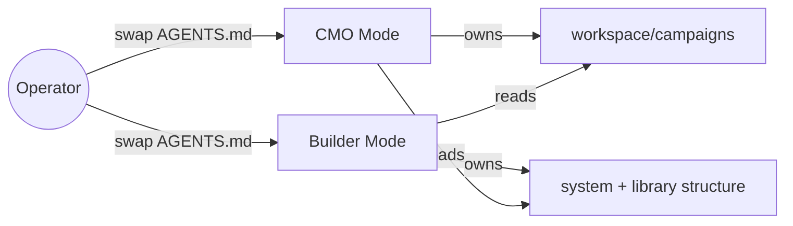
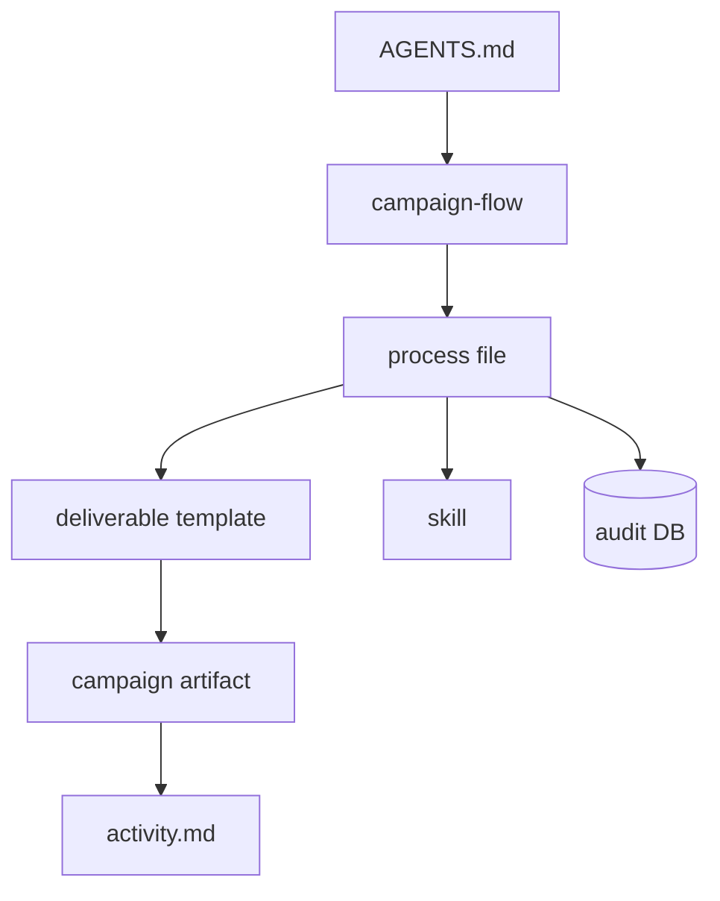
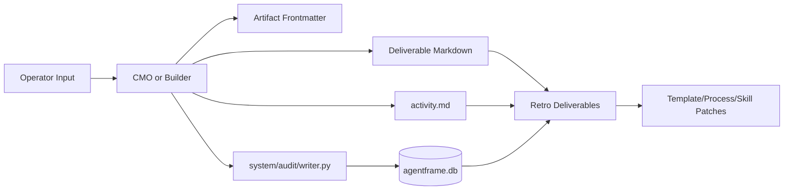

# AgentFrame: Marketing


> **A complete marketing workspace inside the AI coding agent you already use.** No more chat sprawl, no more decisions lost between sessions, no more sycophantic AI freelancing on your writing voice. AgentFrame is a file-native system that rides on top of your favourite AI model, with two `AGENTS.md` modes carrying the work - **CMO** ships campaigns, **Builder** evolves the system itself. Everything in the system is built to evolve with you, improving itself with each campaign you run or when a new marketing skill gets released. Start a campaign, create content and launch your first post in an hour - all in one place.


**Jump to:** [Why](#why-this-exists) · [Quick Start](#quick-start) · [Architecture](#architecture) · [Example Campaign](#example-campaign-workflow) · [Roadmap](#roadmap)


## Table of Contents


- [Why This Exists](#why-this-exists)

- [At A Glance](#at-a-glance)

- [Six Architectural Principles](#six-architectural-principles)

- [Demo](#demo)

- [Quick Start](#quick-start)

- [Recommended Connectors](#recommended-connectors)

- [Architecture](#architecture)

- [Repository Structure](#repository-structure)

- [Example Campaign Workflow](#example-campaign-workflow)

- [Customizability](#customizability)

- [Mode Model: CMO vs Builder](#mode-model-cmo-vs-builder)

- [Solo-flow vs Standard-flow](#solo-flow-vs-standard-flow)

- [Preview Server](#preview-server)

- [Auditability and State](#auditability-and-state)

- [Roadmap](#roadmap)

- [Status](#status)

- [Contributing](#contributing)

- [References and Lineage](#references-and-lineage)

- [License](#license)

- [Contact](#contact)


## Why This Exists


- **Problem.** I looked at the existing AI-marketing landscape and did not think any of the subscription or vibe-coded products were worth it. Why pay monthly for someone else's thin prompt wrapper when I can build my own - one that evolves over time, is not stateless, and is truly portable across whichever coding agent I am using this week?

- **Personal story.** I tried running my own marketing campaigns out of a Claude Code Pro subscription and hit every wall the chat-only workflow has: sycophantic AI, brittle handoffs between sessions, voice rules remembered yesterday and forgotten today, no consistent state for what was actually shipping.

- **A concrete moment.** Open your coding agent and say: "Plan an AI automation POV campaign." CMO reads your operator profile and voice rules, scaffolds a fresh campaign folder, and routes into research. Gemini gets called to produce a deep research artifact under `phase-1-research/`. CMO drafts post copy from the template in your voice, then prepares an Open Design handoff with the campaign design language, visual brief, and first prompt already staged. You open the prepared Open Design project, press Send, revise or export, then Composio schedules the post. After all posts are out, you run a retro, and the patches from that retro make the next campaign sharper.

- **Approach.** Two `AGENTS.md` modes carry the work - CMO ships campaigns, Builder evolves the system. Skills, templates, processes, and flows are interchangeable parts. The durable product is the template/process library, and retros continuously improve it.

- **What it is not.** Not a SaaS. Not a managed agent.

- **Lean by design.** The system is lazy-loaded. Only `AGENTS.md` is always present. Flows, processes, templates, and skills are loaded on demand so context stays focused on the current task, enabling longer sessions without context bloat.

- **Stands on shoulders of:**

  - **[Composio](https://composio.dev/)** for connector-driven publishing and workplace signals.

  - **[heygen-com/hyperframes](https://github.com/heygen-com/hyperframes)** for HTML-to-video composition.

  - **[nexu-io/open-design](https://github.com/nexu-io/open-design)** for local-first design and deck workflows.

  - **[Gemini Deep Research](https://gemini.google/us/overview/deep-research/?hl=en)** for research and image generation.

  - **[blader/humanizer](https://github.com/blader/humanizer)** for copy humanization.


[Back to top](#agentframe-marketing)


## At A Glance


AgentFrame Marketing ships with **11 public deliverable templates**, **13 process files**, **11 skill bundles**, **2 campaign flows**, a **two-mode persona model**, a **preview server**, and **two-layer traceability** (`activity.md` + audit DB).


### Campaign Flows

Campaign flows are full CRUD - add a new one under `library/process/campaign-flows/` to match how your team actually ships.

| Flow | Purpose |

| --- | --- |

| `solo-flow` (default) | Lightweight campaign workflow for one operator moving fast |

| `standard-flow` | Heavier flow closest to enterprise-style campaigns, with broader deliverable coverage and more review gates |


### Deliverable Templates
Templates are yours to evolve - duplicate, restructure, or add new deliverable types under `library/deliverables/` to fit your campaign shape.


| Template | Output |

| --- | --- |

| `business-brief` | Business context and objective framing |

| `research-artifact` | Research synthesis with sources and implications |

| `messaging-architecture` | Core message map and audience framing |

| `design-language` | Visual and style direction |

| `campaign-brief` | Campaign-level strategy and constraints |

| `post-copy` | Platform-ready post copy |

| `carousel-spec` | Slide-by-slide carousel plan |

| `video-spec` | Video concept, scenes, and production plan |

| `campaign-retro` | Campaign-level learnings and improvements |

| `template-retro` | Template quality review and updates |

| `system-retro` | System-level process and architecture improvements |


### Process Files
Process files load on demand, only when the workflow they describe is in play, so they stay out of the way until needed.


| Process | Purpose |

| --- | --- |

| `campaign-flow-authoring` | How to design or evolve campaign flows |

| `process-authoring` | How to design or evolve process files |

| `video-production` | Video workflow from spec to renders |

| `image-production` | Image generation workflow |

| `preview-server` | When and how to use the local preview hub |

| `lock-event` | Lock-state transitions and quality gates |

| `humanizer-integration` | Humanization pass integration |

| `campaign-frontmatter` | Frontmatter schema and state handling |

| `browser-fallback` | Browser automation fallback strategy |

| `composio-notes` | Connector usage notes and caveats |

| `voice-mini-retro` | Lightweight voice quality feedback loop |

| `deliverable-versioning` | Surgical-vs-replacement rule and version-bump procedure for `*-vF.md` deliverables |

| `research-and-signals` | Shared kickoff for campaign research: workspace-context definition, live MCP scan, research-method offer |


### Skills
Skills are this operator's current stack for full production - swap any of them out for a sharper tool without touching campaign templates or processes.


| Skill | Source |

| --- | --- |

| `agentframe-structure` | Project skill |

| `deliverable-scaffolding` | Project skill |

| `system-improvement` | Project skill |

| `docx` | Project skill |

| `pptx` | Project skill |

| `humanizer` | Vendored from [blader/humanizer](https://github.com/blader/humanizer) |

| `hyperframes` | Vendored from [heygen-com/hyperframes](https://github.com/heygen-com/hyperframes) |

| `hyperframes-cli` | Vendored from [heygen-com/hyperframes](https://github.com/heygen-com/hyperframes) |

| `gsap` | Vendored animation skill for HyperFrames workflows |

| `open-design` | Vendored local-first runtime from [nexu-io/open-design](https://github.com/nexu-io/open-design) for image/deck/template-style visual production, with AgentFrame handoff rules in `system/skills/open-design/HANDOFF.md` |

| `browser-harness` | Vendored browser-use harness for controlled CDP-driven browser workflows; routed through Edge with AgentFrame boundary notes in `system/skills/browser-harness/AGENTS.md` |


### Other Core Surfaces


- **Two-mode routing:** `AGENTS.cmo.md` and `AGENTS.builder.md`

- **State as files:** YAML frontmatter plus campaign artifacts in `workspace/campaigns/`

- **Auditability + traceability:** `activity.md` (campaign-readable timeline) + append-only SQLite audit DB at `system/audit/agentframe.db`

- **Preview hub:** `system/server/` for HTML/image/video/PDF/PPTX/DOCX previews

- **Browser harness:** `system/browser/` is browser-use-first for live actions, with documented fallbacks when a workflow needs a hand-driven Chromium session


[Back to top](#agentframe-marketing)


## Six Architectural Principles


### P1 - File-Native State


Campaign progress, decisions, and history live in lightweight files (campaign frontmatter, deliverable markdown, `activity.md`) rather than in a chat window that can clear. Sessions, models, and even machines can change underneath you - the campaign keeps going from where it left off.


### P2 - Lazy Loading for Context Efficiency


`AGENTS.md` routes work, but flows/processes/templates/skills are loaded only when needed. This controls token and context footprint so long sessions stay useful.


### P3 - The Library Is the Product, Not the Harness


Templates, processes, campaign flows, personas, and system prompts are the durable product - they capture how you run campaigns and they improve over time. Skills and connectors (Composio, Gemini, Open Design, HyperFrames, image/video tools) are the swappable layer; when something sharper ships, replace the skill and keep the campaign system intact.


### P4 - Two-Mode Persona Model (CMO + Builder)


CMO ships campaigns. Builder evolves system architecture. This split prevents accidental system edits during campaign execution and accidental campaign edits during infrastructure work.


### P5 - Self-Improving Through Retros


Campaign, template, and system retros convert lived execution feedback into concrete improvements. The system gets stronger with each run.


### P6 - Auditable and Traceable


Two layers capture history:


- `activity.md` for campaign-level, human-readable activity

- append-only audit DB for system-level events (`mode_swap`, `system_changes`, retro outcomes)


Together, these surfaces support timeline reconstruction, metric tracking, and evidence-based iteration.


[Back to top](#agentframe-marketing)


## Demo


The README keeps motion minimal by design: **one hero visual (GIF/WebM recommended)** plus static proof assets.


| 01 · CMO entry | 02 · Research artifact |

| --- | --- |

|  |  |


| 03 · Template-driven deliverable | 04 · Posts |

| --- | --- |

|  |  |


| 05 · Retros | 06 · Mode swap |

| --- | --- |

|  |  |


[Back to top](#agentframe-marketing)


## Quick Start


### Happy Path


1. Clone the repo.

2. Open it in your preferred coding agent (defaults to Builder mode).

3. Open [`AGENTS.md`](AGENTS.md) — the **First run** line points at [`onboarding-checklist.md`](onboarding-checklist.md). Tell the agent **"Help me onboard"** and complete that checklist end-to-end.


### First-Run Builder Onboarding


Fresh clones default to Builder mode. Follow the **First run** section in [`AGENTS.md`](AGENTS.md), then work through [`onboarding-checklist.md`](onboarding-checklist.md):


1. Import operator context (voice, profile, positioning) - Builder will offer to lift this from an existing chat-bot memory if you have one.

2. Recommended connector keys (Gemini, Composio) with how-to-get-it guidance.

3. Optional Open Design runtime setup - Builder can install local deps and check for a code-agent CLI.

4. Remove the **First run** reminder from [`AGENTS.builder.md`](AGENTS.builder.md) and [`AGENTS.md`](AGENTS.md), delete the checklist file, swap to CMO, and log the mode change (see checklist for exact order).


### Mode Swaps


You usually do not run shell commands manually. Tell the agent:


- "swap to Builder"

- "swap to CMO"


The agent handles the file swap and logs the transition.


### Compatibility


Works with coding agents that respect `AGENTS.md` in the working directory, including Claude Code, Codex, Cursor, VS Code, and Antigravity-flavored workflows.


[Back to top](#agentframe-marketing)


## Recommended Connectors


External services AgentFrame integrates with - recommended for the full loop, but not hard-required.


### Gemini API


- research generation at campaign start

- image generation for production deliverables

- free credits from [Google AI Studio](https://aistudio.google.com) are usually enough for solo operators


### Composio


- workplace signal collection (email, calendar, docs, notes, platform data)

- publishing connectors (LinkedIn, X, Instagram, TikTok, and others)

- analytics pullback for retros and iteration


Get started at [composio.dev](https://composio.dev).


### Open Design

- bundled local-first visual runtime at `system/skills/open-design/source/`

- useful for higher-fidelity images, carousels, decks, and template-style visual work

- fresh clones may need runtime dependency setup (`corepack`, `pnpm install`, Node 24), not a separate Open Design product install

- can use a local code-agent CLI on `PATH` (Claude Code, Codex, Gemini CLI, etc.) or BYOK provider keys as a fallback

- AgentFrame prepares the handoff through the Open Design daemon API: campaign design system, selected OD mode/skill, project creation, and the first unsent prompt

- intended operator flow: open the prepared Open Design project, press Send, revise/export inside Open Design, then bring the locked asset back into the campaign


### `.env` shape


```bash

GEMINI_API_KEY=

COMPOSIO_API_KEY=

COMPOSIO_MCP_URL=https://connect.composio.dev/mcp

```


Use whichever model your coding agent provides; these keys support non-LLM runtime surfaces.


[Back to top](#agentframe-marketing)


## Architecture


### Mode Boundary





### Load Path for a Task





### File-Memory Data Flow





Architecture summary:


- `AGENTS.md` is the only always-on router.

- Everything else is loaded on demand to preserve context efficiency.

- Campaign state and outputs live in files; system events are append-only in SQLite.


[Back to top](#agentframe-marketing)


## Repository Structure


```text

agentframe-marketing/

├── AGENTS.md

├── AGENTS.cmo.md

├── AGENTS.builder.md

├── README.md

├── .env.example

├── library/

│   ├── deliverables/

│   ├── process/

│   │   └── campaign-flows/

│   └── context/operator.example/

├── system/

│   ├── skills/

│   ├── server/

│   ├── audit/

│   ├── browser/

│   └── builder-backlog.md

└── workspace/

    └── campaigns/

        └── example-ai-automation-pov/

```


[Back to top](#agentframe-marketing)


## Example Campaign Workflow


See the end-to-end walkthrough in `workspace/campaigns/example-ai-automation-pov/`.


Workflow shape:


1. **Research** - deep research artifacts and source material

2. **Strategy** - messaging and design direction

3. **Planning** - campaign and post planning

4. **Production** - post copy, carousel, video/image deliverables

5. **Publish** - channel-ready output and connector handoff

6. **Retro** - campaign feedback converted into reusable system improvements


[Back to top](#agentframe-marketing)


## Customizability


Everything is swappable:


- **Templates:** add or evolve files under `library/deliverables/`

- **Processes:** add or evolve files under `library/process/`

- **Skills:** add or swap bundles under `system/skills/`

- **Modes:** route between CMO and Builder based on task ownership

- **Voice and positioning:** configure once in `library/context/operator/`, then reuse everywhere


If a better tool appears, swap the skill and keep the campaign system intact. Open Design is now bundled as one concrete example of this pattern: AgentFrame owns campaign state, templates, and the prepared handoff; Open Design owns the generation UI, runtime, revisions, and exports. Locked OD assets return to the calling deliverable's `visuals/imports/` folder.


[Back to top](#agentframe-marketing)


## Mode Model: CMO vs Builder


- **CMO owns:** campaign execution artifacts under `workspace/campaigns/`

- **Builder owns:** system/process/template architecture under `system/` and `library/`

- **Swaps are tracked:** mode changes are logged to audit surfaces

## Solo-flow vs Standard-flow


- **solo-flow (default):** lean, single-operator workflow optimised for speed

- **standard-flow:** heavier flow closest to enterprise-style campaigns, with broader deliverable coverage and more review gates


[Back to top](#agentframe-marketing)


## Preview Server


<details>

<summary>Show preview server details</summary>


- Local preview hub lives in `system/server/`

- Supports HTML, images, video, PDF, PPTX, and DOCX preview surfaces

- Uses folder-tree navigation and hide rules to reduce noise

- Run with `py -3 system/server/run.py`


</details>


## Auditability and State


<details>

<summary>Show auditability details</summary>


- **Campaign layer:** `activity.md` in each campaign for readable timeline tracking

- **System layer:** append-only SQLite audit DB at `system/audit/agentframe.db`

- **Writer:** `system/audit/writer.py`

- **Use case:** reconstruct what happened, how long phases took, and what changed


</details>


[Back to top](#agentframe-marketing)


## Roadmap


- [ ] Preview server v2: improved search, nested live reload, stronger video UX

- [ ] Additional campaign flows beyond solo/standard (newsletter, short-form video series, podcast launch)


## Status


AgentFrame Marketing is actively dogfooded. The full loop runs today: mode-aware routing, flow-driven execution, deliverable generation, preview, publication handoff, and retro-fed system improvement.


## Contributing


- PRs for templates, processes, and skills are welcome.

- Open an issue first for major architecture changes.


## References and Lineage


- [Composio](https://composio.dev)

- [heygen-com/hyperframes](https://github.com/heygen-com/hyperframes)

- [nexu-io/open-design](https://github.com/nexu-io/open-design) (Apache-2.0, vendored under `system/skills/open-design/source/`)

- [GreenSock GSAP](https://greensock.com/gsap/)

- [Google AI Studio / Gemini](https://aistudio.google.com)

- [blader/humanizer](https://github.com/blader/humanizer)


## License


MIT. See [`LICENSE`](LICENSE).


## Contact


Add operator contact links here:


- LinkedIn

- Personal site

- X


[Back to top](#agentframe-marketing)

