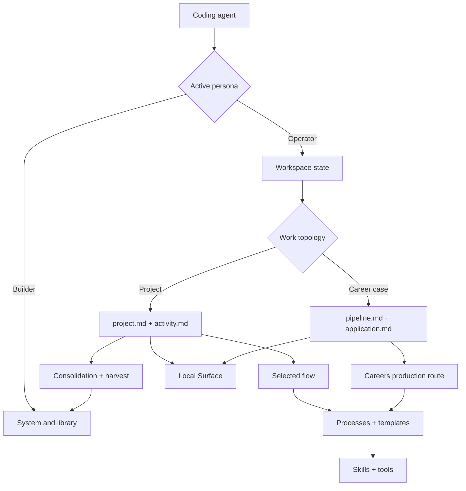

# AgentFrame


AgentFrame is a file-native AI workspace for running real work inside coding agents. It gives the model a durable map of your projects, context, decisions, deliverables, tools, and feedback loops, then gets out of the way so the model can do what it is already good at.

I am not a software engineer. I built AgentFrame because raw chat windows were a bad place to manage several projects at once: context disappeared, decisions drifted, files forked, and every new session needed the same briefing. The answer was not another AI wrapper. It was a workspace that made the context legible enough for any capable coding agent to pick up the work.

AgentFrame now combines three layers:

- **Prompt engineering:** reusable personas, templates, process files, and production rules.
- **Context engineering:** a graph of plain files that tells the agent what to load, what owns the truth, and what can stay out of context until it is needed.
- **Loop engineering:** bounded goals, iteration budgets, checkpoints, deterministic gates, independent review, and retros that improve the system after the work ships.

The default is a domain-neutral **open-flow project**. Give it an objective and it proposes a plan scaled to the work. Marketing, governed project management, and careers add stronger structures when those structures are useful; they are not required to make the workspace useful.

<p align="center">
  <a href="LICENSE"></a>
  
  
</p>

## What makes it different

### One workspace, many projects, many agents

Each project carries its own objective, plan, source material, working knowledge, deliverable tracker, and activity history. I can run agents against different projects in parallel without asking a chat thread to remember which facts belong where. A new agent can reconstruct the state from disk after a provider switch, a memory compaction, or a month away.

### The open project is the universal surface

`project-mgmt + open-flow` is the default because a project is the lowest useful denominator for knowledge work. It adds no domain-specific fields and derives no governance ceremony. The agent proposes only the phases and artifacts the objective needs, and every tracked deliverable still gets versioning, state, review, and history.

You do not need to author a domain pack before AgentFrame can help. Packs exist for repeated work where a stronger schema, vocabulary, or gate has earned its place.

### Files are the memory; the interface is derived

The Local Surface looks like an application: dashboard, attention queue, project calendar, timeline, work blocks, previews, and multi-format viewers. Underneath, it is a Python server reading the same markdown and media files the agents use. There is no second project database to reconcile and no LLM call required to render it.

That is the point of the dashboard. It is proof that the workspace state is coherent enough to become an interface without first being translated into another system.

### Buttons own mechanics; agents own judgment

Models are strong at research, synthesis, critique, and drafting. They are less reliable at remembering exact bookkeeping steps for months. `system/af.py` therefore owns state transitions such as project creation, versioning, locking, publishing, pipeline movement, doctor checks, and autonomous-run checkpoints.

The command changes the files and writes the paper trail atomically, then hands the judgment back to the agent. Required export, verification, and state gates are enforced in code instead of being left as polite instructions.

### Context loads as a graph, not a giant prompt

Only the active persona loads by default. Project state points to the selected flow; the flow points to the process or template needed for the current step; skills load only when the work calls for them. Raw sources remain separate from distilled working knowledge, and long-running projects periodically consolidate resolved detail into archives.

The result is a large workspace with a deliberately small active context window.

### The system learns from finished work

Project closeout is not just an archive step. AgentFrame compares drafts, manual edits, locked outputs, and workflow friction to propose improvements to templates, processes, and voice.

The voice system is anchored in complete pieces I would actually publish, then steered with channel-specific registers and annotated contrastive pairs showing how I rewrite generic AI prose. The full pieces provide the imitation target; the pairs teach the moves.

### Autonomy is a contract, not a vibe

For work that benefits from iteration, bounded-autonomy runs declare the goal, evidence of completion, allowed write paths, model roles, iteration and subagent budgets, checkpoints, reviewer mode, and stop conditions. The frontier model plans and controls; economical scouts can gather context; workhorse executors implement bounded units; an independent reviewer challenges completion when the run is unattended.

The loop can move quickly without quietly expanding its own authority.

## Quick start

1. Clone the repository:

   ```bash
   git clone https://github.com/situhacks/agentframe.git
   cd agentframe
   ```

2. Open the folder in Claude Code, Codex, Cursor, VS Code, Antigravity, or another coding agent that can read and write the workspace.

3. Copy `.env.example` to `.env` if you want optional Gemini or Composio integrations. The local workspace, CLI, project system, and Local Surface work without API keys.

4. Tell the agent: **“Swap to Operator and start a new project.”** The default command is equivalent to:

   ```bash
   python system/af.py new-project my-project --domain project-mgmt --flow open-flow
   ```

   The agent will propose a plan scaled to the objective. Nothing governed is created unless the work needs it.

5. Install the Local Surface dependencies, then open it:

   ```bash
   pip install -r system/server/requirements.txt
   python system/server/run.py --daemon
   ```

### Modes

AgentFrame uses two generated `AGENTS.md` personas with a hard ownership boundary:

- **Operator** runs projects and career work under `workspace/` and reads the system on demand.
- **Builder** evolves the templates, packs, processes, personas, CLI, and runtime under `library/` and `system/`.

Mode swaps copy the canonical persona and append the transition to the local audit database in one operation. The CLI refuses Operator state transitions while Builder is active.

### Pulling upstream changes

Personal context, projects, pipeline data, and the audit database are gitignored. In Builder mode, ask the agent to **“pull upstream AgentFrame updates.”** The upstream-sync skill can walk changes commit by commit or apply a reviewed bulk migration without overwriting the personal layer.

## What it can run

AgentFrame currently ships three domain packs and two work topologies.

| Surface | What it is for | Default shape |
|---|---|---|
| **Open project** | The domain-neutral starting point for research, planning, building, writing, analysis, or any other objective the model and its tools can handle | `project-mgmt` + `open-flow`; no fixed phase ladder or mandatory governance files |
| **Governed project** | Longer engagements that benefit from a charter, RAID log, stakeholder map, decision log, and workback schedule | `project-mgmt` + opt-in `project-mgmt-open-flow` |
| **Marketing project** | Research, campaign architecture, copy, visuals, video, decks, publishing, and performance capture | `marketing` + open flow or an opt-in marketing phase ladder |
| **Career workspace** | Ongoing career context, internal progression, promotion evidence, coach/manager preparation, and structured cases | Career bank + calendar/pipeline + application-shaped case folders |

### Career development first

The career workspace is designed first as a durable record of work and growth. It can hold role expectations, KPIs, proof points, resume bullets, stories, manager and coach context, employer history, promotion rubrics, cycle dates, and evidence gathered from completed projects. The calendar and pipeline make upcoming conversations, submission dates, and follow-ups visible alongside the rest of the workspace.

An internal promotion case uses the same mechanics as any evidence-backed application: the rubric becomes the requirements source, the JD map becomes a rubric map, gaps become a plan to produce stronger evidence, and the final material can be a deck rather than a resume.

The pack also supports external applications, ATS-aware resume and cover-letter export, and login-free job scouting. I included that complete path because I have built versions of this workflow for students and other people navigating the market. It is one use of the career substrate, not the center of AgentFrame.

### Technical builds without splitting the brain

When a project phase turns into a proof of concept or application, the code lives in its own repository while AgentFrame keeps the plan, sources, decisions, and build log. Behavior Decision Records turn requirements into observable tests. At graduation, the repository receives compiled native context and AgentFrame stops orchestrating it.

One brain during the build; one deliberate context transfer when the project can stand on its own.

## A marketing project, end to end

The marketing pack is the most visual example of the same project spine: context in, versioned work through, learning back out.

<table>
<tr>
<td width="50%" valign="top"><br/><sub><b>1 · Kickoff</b> — Scaffold the project, load operator context, gather live signals, and choose the research depth.</sub></td>
<td width="50%" valign="top"><br/><sub><b>2 · Research</b> — Use Gemini Deep Research or the native multi-role research skill and keep the cited artifact in the project.</sub></td>
</tr>
<tr>
<td width="50%" valign="top"><br/><sub><b>3 · Draft</b> — Build from templates, the gold voice corpus, register guidance, and project evidence. Every replacement-shaped revision becomes a snapshot.</sub></td>
<td width="50%" valign="top"><br/><sub><b>4 · Produce</b> — Route images, diagrams, decks, carousels, or video through the appropriate production process.</sub></td>
</tr>
<tr>
<td width="50%" valign="top"><br/><sub><b>5 · Deliver</b> — Deterministic gates verify locked copy and landed exports before publishing or delivery is recorded.</sub></td>
<td width="50%" valign="top"><br/><sub><b>6 · Learn</b> — Harvest real edits and workflow friction into proposed voice, template, and process improvements.</sub></td>
</tr>
</table>

## Architecture


```mermaid
flowchart TD
    A["Coding agent"] --> B{"Active persona"}
    B -->|"Operator"| C["Workspace state"]
    B -->|"Builder"| D["System and library"]

    C --> E{"Work topology"}
    E -->|"Project"| F["project.md + activity.md"]
    E -->|"Career case"| G["pipeline.md + application.md"]

    F --> H["Selected flow"]
    G --> I["Careers production route"]
    H --> J["Processes + templates"]
    I --> J
    J --> K["Skills + tools"]

    F --> L["Local Surface"]
    G --> L
    F --> M["Consolidation + harvest"]
    M --> D
```

### Architectural rules

- **The default project is domain-neutral.** `project-mgmt/open-flow` contributes no domain fields and no mandatory governance ceremony.
- **Specialization is additive.** Packs declare vocabulary, templates, valid verbs, optional rules, and topology-specific routes.
- **Files own working truth.** Markdown and media hold project state, context, decisions, and outputs. SQLite is reserved for the append-only system-change audit.
- **Sources and knowledge are different things.** Immutable inputs live in `sources/`; distilled working context lives in `knowledge/`.
- **Prose owns judgment; mechanisms guarantee invariants.** The agent decides what good work is. The CLI and hooks protect state, exports, and repeatable gates.
- **The Local Surface is a reader.** It does not become a competing state owner.
- **Templates are the durable product.** Skills and runtimes can be replaced without rewriting the deliverable library.

## The capability library

The library is intentionally modular. A project loads only the process and skill needed for the current step, but the complete production stack is already in the box.

### Processes

| Process | What it gives the agent |
|---|---|
| `bounded-autonomy` | Goal contracts, authority levels, model routing, budgets, checkpoints, reviewer gates, and stop rules |
| `browser-fallback` | A controlled browser route when a supported API, connector, or CLI is unavailable |
| `career-harvest` | Promotion of real project wins into proof points, reusable stories, and resume-bank bullets |
| `composio-notes` | Connected-workspace publishing and performance-capture conventions |
| `deck-production` | Central deck routing with PPT Master as the default for new PowerPoint work |
| `deliverable-versioning` | Head pointers, immutable snapshots, and surgical-versus-replacement revision judgment |
| `diagram-production` | Static graph-shaped explainers through D2 |
| `flow-authoring` | The standard for adding or materially reshaping project flows |
| `humanizer-integration` | A calibrated humanization pass where a template explicitly calls for it |
| `image-production` | Path selection for generated imagery, HTML visuals, Open Design, and other image routes |
| `knowledge-base` | Source ingestion, living knowledge files, archives, and consolidation rules |
| `lock-event` | Generic lock mechanics and the post-lock judgment checklist |
| `operator-context-setup` | First-run generation of personal positioning, profile, career, and voice surfaces |
| `preview-server` | Start-or-open behavior, deep links, and preview hygiene for the Local Surface |
| `process-authoring` | The standard for reusable process files |
| `project-frontmatter` | Canonical project state, tracker schema, overrides, and drift checks |
| `research-and-signals` | Kickoff context scans and research-method selection |
| `substack-publishing` | Draft preparation, editor handoff, back-publishing, and live-result reconciliation |
| `technical-build` | External-repository orchestration, BDRs, derived status, and graduation |
| `video-production` | Talking-head, HyperFrames, generated-asset, and hybrid video routes |
| `voice-mini-retro` | The lock-time eligibility gate for harvesting meaningful voice edits |
| `voice-setup` | Corpus mining, taste interview, register compilation, and initial voice-system setup |

The live process catalog, including load triggers, is [`library/process/README.md`](library/process/README.md).

### Skills

| Skill | What it does |
|---|---|
| `agentframe-structure` | Safely changes flows, deliverable types, defaults, and ownership boundaries |
| `browser-harness` | Runs local CDP-driven browser workflows |
| `d2-diagrams` | Renders deterministic SVG diagrams through a pinned D2 binary |
| `deep-research` | Runs architect → specialist → synthesis research on the agent's own tools |
| `deliverable-harvest` | Mines finished projects for earned template and process improvements |
| `deliverable-scaffolding` | Creates deliverable instances with the correct shape and frontmatter |
| `doc-export` | Produces ATS-safe resume and cover-letter files keyed to the destination system |
| `docx` | Creates, inspects, and edits Word documents |
| `extract-design` | Measures a website's design language through the `designlang` CLI |
| `humanizer` | Detects and removes common AI-writing patterns |
| `hyperframes` | Full HyperFrames source, Studio, and routed video skill library |
| `job-scout` | Sweeps public ATS feeds against the career search profile without login automation |
| `open-design` | Provides a local-first advanced image and deck runtime |
| `ppt-master` | Converts sources into designed SVG pages and native-editable PowerPoint decks |
| `pptx` | Inspects, validates, extracts, and performs small native PowerPoint edits |
| `project-consolidate` | Archives stale project detail and promotes durable context across projects |
| `system-improvement` | Applies scoped system patches with verification and audit discipline |
| `upstream-sync` | Adopts upstream AgentFrame changes without overwriting the personal layer |
| `voice-harvest` | Turns finished work and manual edit deltas into corpus examples and contrastive pairs |

The live skill catalog and provenance notes are in [`system/skills/README.md`](system/skills/README.md).

## Local Surface

`python system/server/run.py --daemon` starts or reuses the local server and opens the workspace UI.

The Surface currently provides:

- A dashboard of active projects, attention items, and recent activity
- Day, week, and month calendar views
- A multi-month swimlane timeline with active-first sorting
- Work blocks derived from actual logged activity
- Deliverable and shipped-media markers with hover previews
- An IDE-style preview workspace with tabs and splits
- Markdown, text, HTML, image, PDF, video, PPTX, and DOCX viewing
- Completed-project history and print/PDF calendar output
- File watching and LiveReload for production work

It reads deterministically from the workspace. No model and no API key are required.

## Repository map

```text
agentframe/
├── AGENTS.md                   # generated active persona
├── AGENTS.operator.md          # project execution and routing
├── AGENTS.builder.md           # system architecture and maintenance
├── library/
│   ├── context/                 # operator, people, channel, career, and voice context
│   ├── deliverables/            # shared deliverable templates
│   ├── domains/                 # marketing, project-mgmt, careers
│   ├── process/                 # flows and on-demand procedures
│   └── assets/                  # logos and reusable deck templates
├── system/
│   ├── af.py                    # deterministic state-transition CLI
│   ├── audit/                   # append-only system-change audit
│   ├── browser/                 # browser runtime and recipes
│   ├── hooks/                   # deterministic production guards
│   ├── research/                # Gemini deep-research runtime
│   ├── server/                  # Local Surface and preview server
│   ├── skills/                  # owned and vendored capabilities
│   ├── tests/                   # CLI, guards, Surface, and runtime tests
│   └── tools/                   # pinned local tool binaries
└── workspace/
    ├── projects/                # open-flow and structured projects
    └── pipeline/                # career board and case folders
```

## Integrations and production runtimes

AgentFrame itself runs locally. External services and bundled production runtimes add capabilities rather than becoming dependencies.

| Integration or runtime | Used for |
|---|---|
| Gemini | Deep Research and image generation through the local helper |
| Composio | Connected-workspace context, publishing, and performance capture |
| Open Design | Local-first advanced visual and deck production |
| PPT Master | Native-editable deck generation from source material and SVG |
| HyperFrames | HTML-to-video composition and rendering |

Your coding agent provides the model. Environment keys power only the optional external tools.

## Auditability

- `project.md` or `application.md` owns current state.
- `activity.md` records material project events.
- Version files explain what changed from the previous head.
- `system/af.py doctor` checks schemas, files, exports, mirrors, and pack rules without silently fixing them.
- `system/audit/agentframe.db` records low-volume system changes such as mode swaps, template patches, runtime changes, and migrations.
- Git carries the version history of the reusable system; personal work remains local and ignored.

## Design constraints

AgentFrame stays useful by refusing a few tempting directions:

- It is not a replacement model or a wrapper around one provider.
- It does not copy every fact into a vector database by default.
- It does not make the dashboard a competing source of truth.
- It does not encode every possible workflow before real work earns the abstraction.
- It does not let scripts make creative or project-management judgments.

The durable asset is the context, workflow knowledge, and deliverable library. Models, tools, and interfaces can change around it.

## Contributing

PRs for templates, process improvements, domain packs, skills, and runtime fixes are welcome. Open an issue before a major architecture change so the system does not grow faster than future agents can understand it.

## References and lineage

- [agentframe-marketing](https://github.com/situhacks/agentframe-marketing) — the frozen marketing-only predecessor
- [Composio](https://composio.dev)
- [Open Design](https://github.com/nexu-io/open-design)
- [PPT Master](https://github.com/hugohe3/ppt-master)
- [HyperFrames](https://github.com/heygen-com/hyperframes)
- [design-extract](https://github.com/Manavarya09/design-extract)
- [humanizer](https://github.com/blader/humanizer)
- [DeepResearch Bench](https://huggingface.co/spaces/muset-ai/DeepResearch-Bench-Leaderboard)
- [LunonAI deep research](https://github.com/LunonAI/lunon-deep-research)
- [deer-flow](https://github.com/bytedance/deer-flow)
- [open_deep_research](https://github.com/langchain-ai/open_deep_research)

## License

MIT. See [`LICENSE`](LICENSE).

## Contact

Built by Brandon Situ over many weekends — and likely many more.

- [LinkedIn](https://www.linkedin.com/in/brandonsitu/)
- Email: brandonzsitu@gmail.com
