# AgentFrame

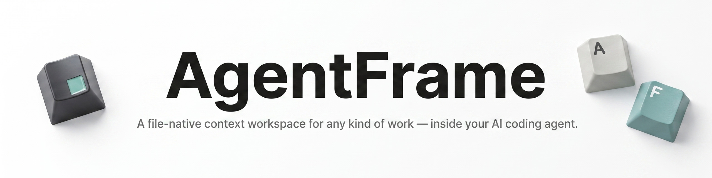

AgentFrame is a file-native context workspace for running any kind of work alongside coding agents. It works with Claude Code, Codex, Cursor, VS Code, Antigravity, or anything else that can read files because the projects, context, deliverables, decisions, and feedback loops are all plain markdown files. Everything about your work stays organized, so a fresh agent can read the workspace and pick up where you left off without a lengthy re-explanation.

I built it for my professional and personal work over many weekends, with likely many more to come. It's free to fork, so take whatever is useful for your own setup.

<p align="center">
  <a href="LICENSE"></a>
  
  
</p>

## Table of contents

- [Why this exists](#why-this-exists)
- [Key features](#key-features)
- [Quick start](#quick-start)
- [What it can run](#what-it-can-run)
- [A real project, step by step](#a-real-project-step-by-step)
- [At a glance](#at-a-glance)
- [Architecture](#architecture)
- [The Workspace Dashboard](#the-workspace-dashboard)
- [Repository map](#repository-map)
- [Integrations](#integrations)
- [Auditability](#auditability)
- [Design constraints](#design-constraints)
- [Contributing](#contributing)
- [References and lineage](#references-and-lineage)
- [License](#license)
- [Contact](#contact)

## Why this exists

The first version of AgentFrame was a marketing system. It came from trying to run campaigns in raw AI chat windows. Individual chats became huge token sinks with context rot, while starting a new chat meant briefing it again on the same task. I created AgentFrame to organize my context into structured files, so one prompt could become a repeatable process and one campaign could become an example for future ones.

Then I kept using the marketing system for work that had nothing to do with marketing. I ran PowerPoint redesigns through it, made Word document deliverables, and did small research jobs by asking my coding agent to treat them as "campaigns." That worked surprisingly well, which made the useful part of AgentFrame obvious: it was not just the marketing workflow but the context organization. It was the way the system kept project state, versioned the work, and carried the right information into the next step.

So I rebuilt AgentFrame around the smallest piece of work: projects. Marketing is still there, but now it is one domain pack beside project management and careers, while the core handles the things all of them share: context, state, deliverables, and the path between them. That rebuild also gave me the parts I care about most now, including long-horizon memory that can consolidate without forgetting, a voice system trained on my actual edits, and deliverables that keep a version trail.

The original marketing-only system is frozen at [agentframe-marketing](https://github.com/situhacks/agentframe-marketing). This repository is its successor.

## Key features

AgentFrame keeps its context, working rules, and project state in files that any coding agent can read.

### 1. Pick up a project without re-briefing

- **Reconstruct the project from disk.** After a memory compaction, a provider switch, or a month-long hiatus, a fresh agent reads the project files and continues from the same state. You do not need to write a catch-up paragraph or upload the brief again.

- **Keep sources and working knowledge separate.** Transcripts and briefs land in `sources/` and never get edited. The agent maintains what it has learned from them in `knowledge/`, and a consolidation pass archives resolved detail when the active context gets too big.

- **Load only what the task needs.** The stable root selects one task router; that router points to the project or system owner, and those files route to the process for the current step. Skills stay out of context until the work calls for them, so the workspace can get large without every chat carrying all of it.

### 2. Reuse instructions shaped by real work

- **Start from templates and processes that have already been used.** Every deliverable shape and workflow in the library has been refined through real work. The coding agent model and tools can change without affecting the underlying system knowledge.

- **Add specialised structure through domain packs.** Marketing, project management, and careers ship today. Adding another domain means adding its templates and descriptor rather than rewriting the core.

- **Teach the voice system from real edits.** It reads complete pieces you have published, keeps reusable voice registers separate from channel rules, and compares agent drafts against your rewrites. A formal or informal voice can travel across posts, emails, decks, and essays, with an explicit blend when one register needs a controlled borrow from the other.

<p align="center">
  
</p>

### 3. Keep state and automation deterministic

- **Run project state changes through commands.** Models are good at research, synthesis, and drafting; deterministic commands handle the exact bookkeeping. The `system/af.py` script manages creation, versioning, readiness, publishing, and doctor checks without using model tokens. If anything is out of order, it flags the problem for the agent to reason over.

- **Keep a version trail for every deliverable.** Replacement-shaped revisions become immutable snapshots, the tracker or artifact folder identifies the current numeric head, and readiness gates run before use or sharing. When the deliverable needs a real file (e.g., PPTX, DOCX), the export is tracked too.

- **Record what happened as part of the work.** Activity logs and version notes cover projects, while an append-only audit database records system changes. `af doctor` reports drift without silently fixing it.

- **Run standing project work through managed automations.** A project can define a job, receive queued tasks, and run them through a bounded local agent that returns a `done`, `bready`, or `failed` receipt. The included deployment path uses Power Automate, OneDrive, and a single-flight Cursor host. This part of the system is early and currently being tested in real use.

### 4. Learn deliberately from finished work

- **Feed finished work back into the system.** When a project closes, harvest passes compare agent drafts with the operator's manual edits and the friction logged along the way. They propose changes to templates, processes, or the voice corpus, but nothing updates itself automatically; at least one short human review step remains.

- **Bound experiments before they run unattended.** A bounded run defines its goal, evidence of completion, iteration budget, and review points before the agent starts. The contract currently lives in one process file, [`bounded-autonomy.md`](library/process/bounded-autonomy.md), and remains an evolving part of the system.

### 5. See the workspace without another database

- **Render the workspace from the same files the agents use.** The dashboard covers projects, attention items, the calendar, and the timeline without adding another database or making a model call. It provides a quick operational view while demonstrating that the underlying files are coherent enough to become an interface.

- **See what the automation runtime is doing.** The read-only Automations tab shows waiting requests, terminal receipts, exceptions, and mismatches between a project's declared lifecycle and the local runtime. It reports problems without starting, retrying, or changing an automation.

More detail is in [The Workspace Dashboard](#the-workspace-dashboard).

## Quick start

1. Clone the repository:

   ```bash
   git clone https://github.com/situhacks/agentframe.git
   cd agentframe
   ```

2. Open the folder in Claude Code, Codex, Cursor, VS Code, Antigravity, or another coding agent that can read and write the workspace.

3. Copy `.env.example` to `.env` if you want the optional Gemini or Composio integrations. The workspace, CLI, project system, and dashboard all run without API keys.

4. Tell the agent: **"Start a new project."** The stable root routes project work to the Operator instructions; under the hood the state transition is:

   ```bash
   python system/af.py new-project my-project --domain project-mgmt --flow open-flow
   ```

   The agent proposes a plan scaled to your objective. Nothing governed is created unless the work needs it.

5. Optionally, start the Workspace Dashboard:

   ```bash
   pip install -r system/server/requirements.txt
   python system/server/run.py --daemon
   ```

### Modes

One stable `AGENTS.md` classifier routes each task to a lazy-loaded instruction file with a hard ownership boundary:

- **Operator** runs projects and career work under `workspace/` and reads the system on demand.
- **Builder** evolves the templates, packs, processes, personas, CLI, and runtime under `library/` and `system/`.

The root file is never rewritten to change modes. An agent reads only the task-local router it needs, then switches routers if the task's ownership changes. Managed unattended work has its own overlay.

### Pulling upstream changes

Personal context, projects, pipeline data, and the audit database are gitignored, so your working layer never collides with updates. Ask the agent to **"pull upstream AgentFrame updates."** The root routes that system task to Builder; the sync skill walks changes commit by commit, or applies a reviewed bulk migration, without touching the personal layer.

## What it can run

Three domain packs and two work topologies ship today.

| Surface | What it is for | Default shape |
|---|---|---|
| **Open project** | The domain-neutral starting point for research, planning, building, writing, or analysis; use it for any objective the model and its tools can handle | `project-mgmt` + `open-flow`; no fixed phase ladder, no mandatory governance files |
| **Governed project** | Longer engagements that benefit from a charter, RAID log, stakeholder map, decision log, and workback schedule | `project-mgmt` + opt-in governance flow |
| **Marketing project** | Research, campaign architecture, copy, visuals, video, decks, publishing, and performance capture | `marketing` + open flow or an opt-in phase ladder |
| **Career workspace** | Ongoing career context, internal progression, promotion evidence, and structured application cases | Career bank + calendar/pipeline + case folders |

The open project is the default because most work fits inside a project shape before it needs anything more specialised. A frontier model can reason about and tailor the project for just about anything, so you do not have to design a domain pack every time. Packs are for the jobs you repeat often enough to justify a stronger shape.

### Technical builds without splitting the brain

When a project turns into a proof of concept or an application, the code lives in its own repository while AgentFrame keeps the plan, sources, decisions, and build log. Once that repository is mature enough, it receives the context it needs and AgentFrame stops orchestrating the build.

## A real project, step by step

The content changes between packs, but the project path stays familiar: bring the context in, version the work as it changes, deliver it through a gate, and keep what the next project should learn.

### A governed project

The project-management pack takes a charter and turns it into living context the agent maintains for months.

<table>
<tr>
<td width="50%" valign="top">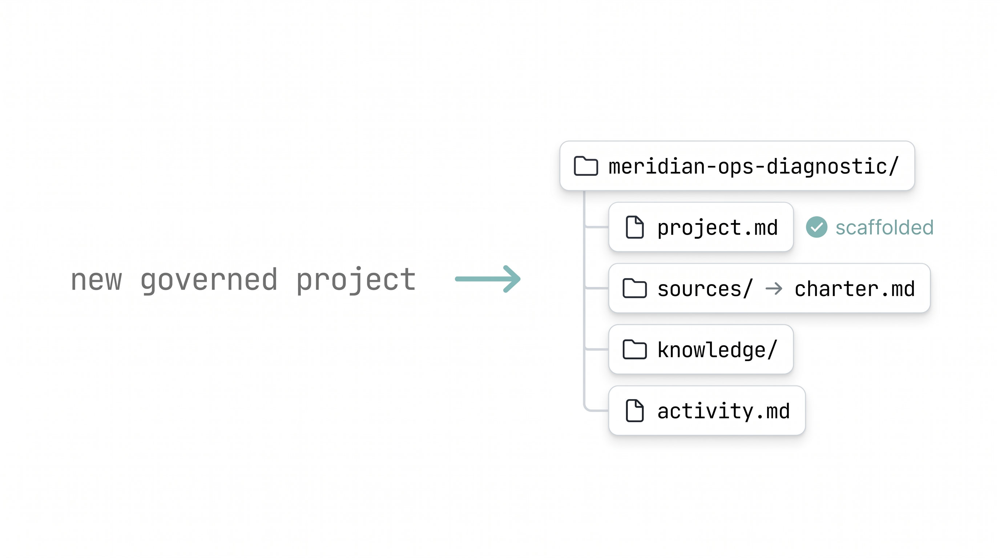<br/><sub><b>1 · Kickoff.</b> Tell the agent to start a new governed project. It scaffolds the workspace from the pack skeleton and files your charter into the project's <code>sources/</code>.</sub></td>
<td width="50%" valign="top">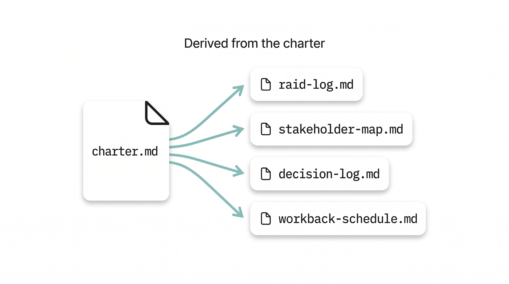<br/><sub><b>2 · Derive the knowledge base.</b> From the charter, the agent derives living context files under <code>knowledge/</code>: a RAID log, a stakeholder map, a decision log, and a workback schedule.</sub></td>
</tr>
<tr>
<td width="50%" valign="top">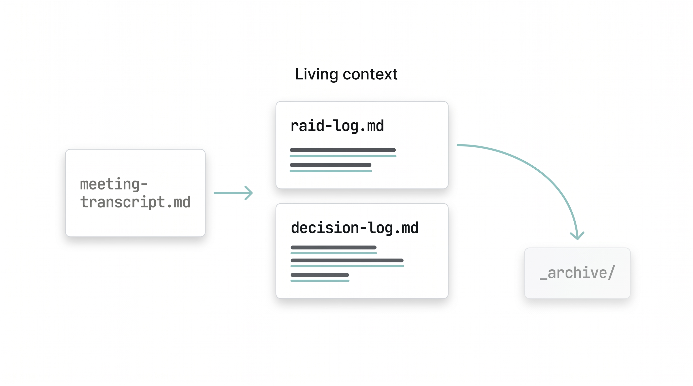<br/><sub><b>3 · Maintain and consolidate.</b> Meeting transcripts land in <code>sources/</code>; the agent updates the RAID log, appends decisions, and re-plans the schedule. On long projects, a consolidation pass archives resolved items so active files stay lean without losing history.</sub></td>
<td width="50%" valign="top">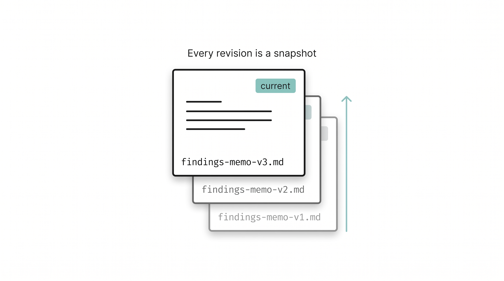<br/><sub><b>4 · Draft deliverables.</b> Findings, memos, and decks are drafted in your voice from the deliverable library, and every replacement-shaped revision becomes an immutable <code>-v{N}</code> snapshot.</sub></td>
</tr>
<tr>
<td width="50%" valign="top">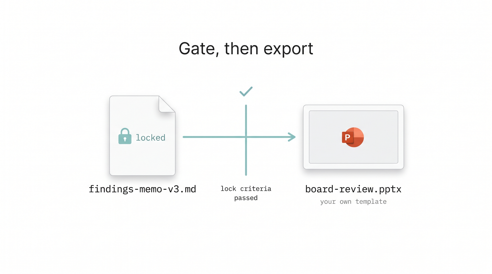<br/><sub><b>5 · Deliver.</b> Deliverables pass readiness criteria before delivery is recorded, including deck exports in your own PowerPoint template when the destination needs a file.</sub></td>
<td width="50%" valign="top">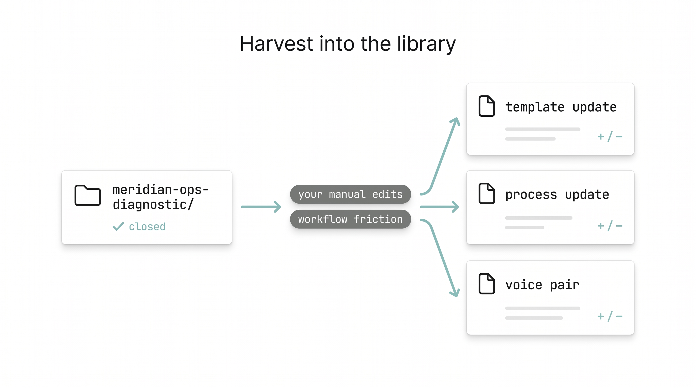<br/><sub><b>6 · Learn.</b> Closeout harvests your manual edits and workflow friction into proposed template, process, and voice improvements.</sub></td>
</tr>
</table>

### A marketing campaign

The marketing pack has the most visual production because it is where this workspace started.

<table>
<tr>
<td width="50%" valign="top">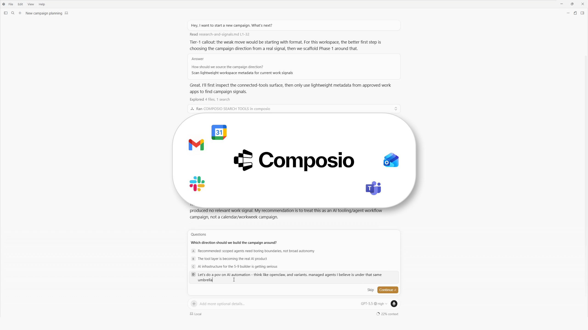<br/><sub><b>1 · Kickoff.</b> Scaffold the project, load operator context, gather live signals, and choose the research depth.</sub></td>
<td width="50%" valign="top">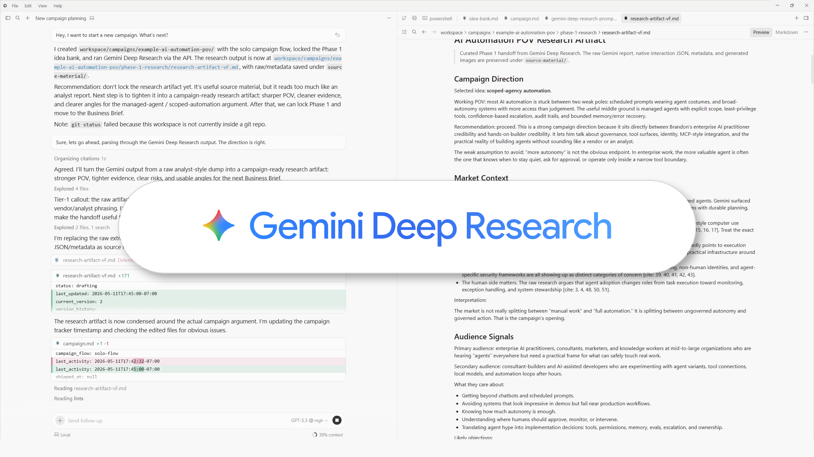<br/><sub><b>2 · Research.</b> Use Gemini Deep Research or the native multi-role research skill and keep the cited artifact in the project.</sub></td>
</tr>
<tr>
<td width="50%" valign="top">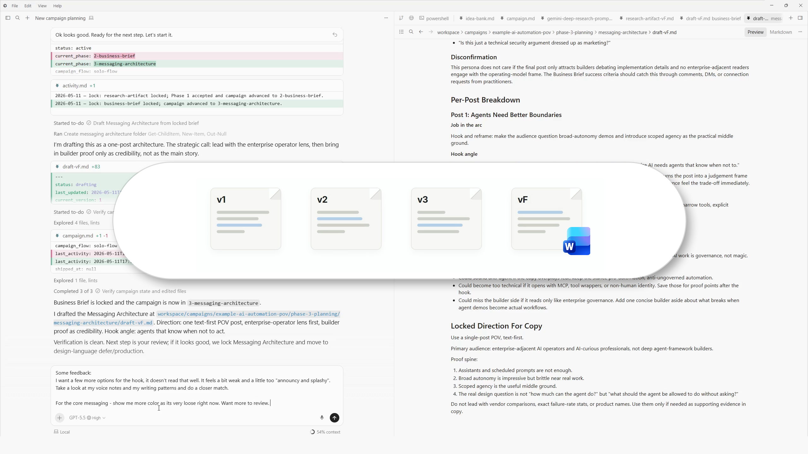<br/><sub><b>3 · Draft.</b> Build from templates, the gold voice corpus, register guidance, and project evidence. Every replacement-shaped revision becomes a snapshot.</sub></td>
<td width="50%" valign="top">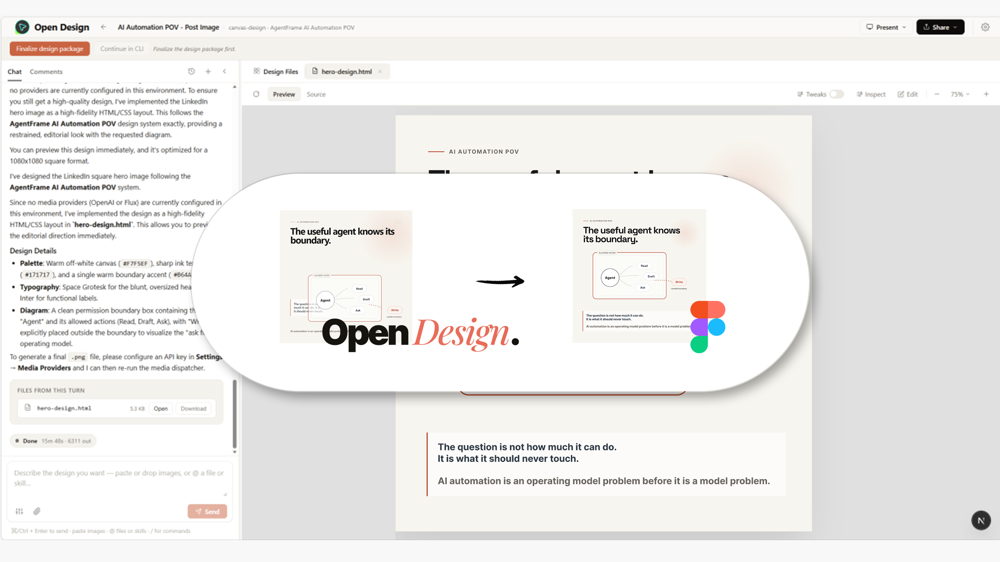<br/><sub><b>4 · Produce.</b> Route images, diagrams, decks, carousels, or video through the appropriate production process.</sub></td>
</tr>
<tr>
<td width="50%" valign="top">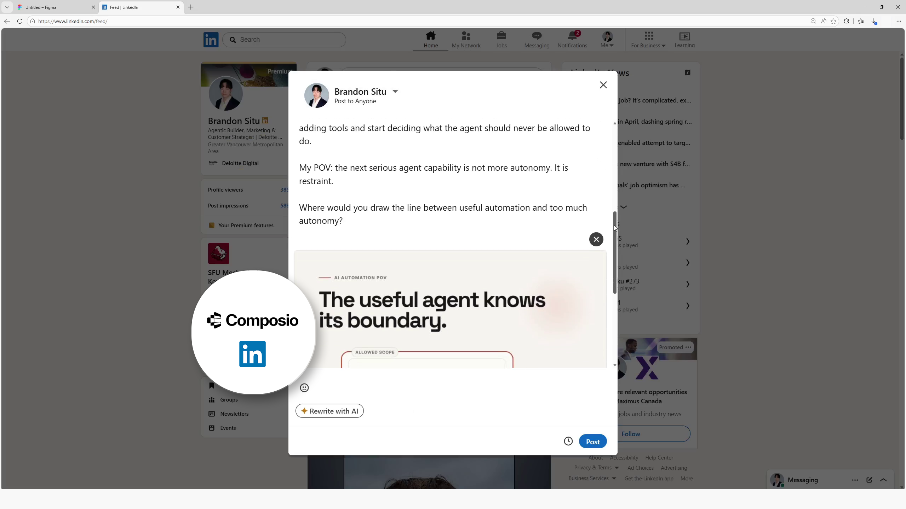<br/><sub><b>5 · Deliver.</b> Deterministic gates verify ready copy and landed exports before publishing is recorded.</sub></td>
<td width="50%" valign="top">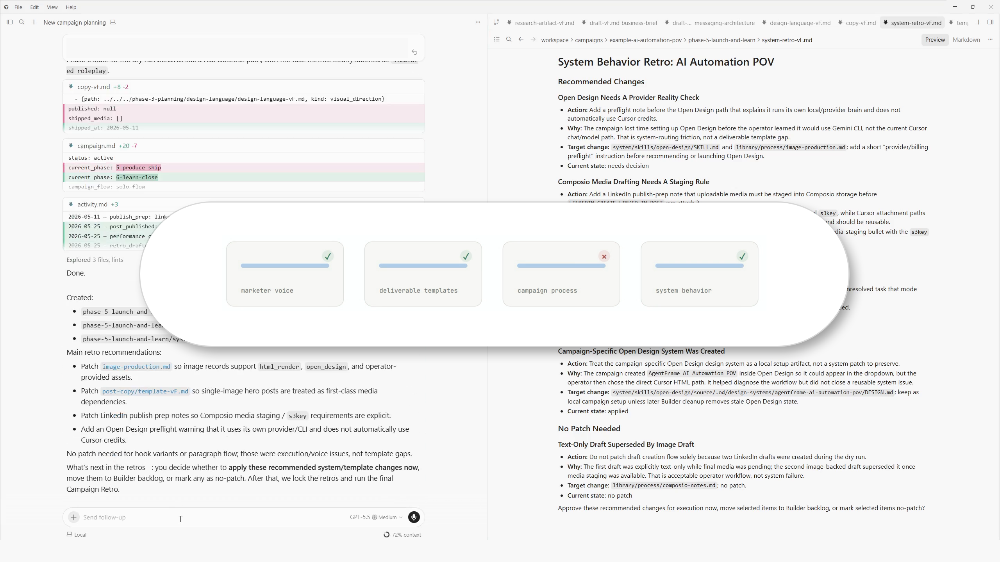<br/><sub><b>6 · Learn.</b> Harvest real edits and workflow friction into proposed voice, template, and process improvements.</sub></td>
</tr>
</table>

### A career workspace

The careers pack treats your own career as a long project. It is built first for the internal case: turning the work you are already doing into promotion evidence, because this is a work workspace before it is a job-search tool. The same system also handles external searching and login-free job scouting when you need it.

<table>
<tr>
<td width="50%" valign="top">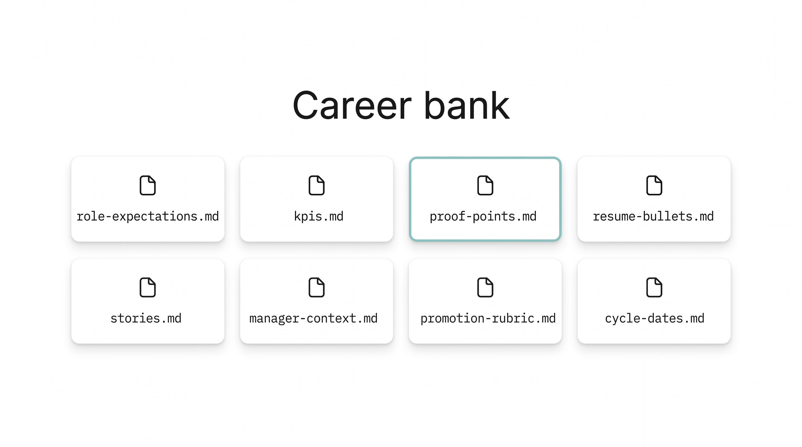<br/><sub><b>1 · Build the career bank.</b> Role expectations, KPIs, proof points, resume bullets, stories, manager context, promotion rubrics, and cycle dates live as durable files.</sub></td>
<td width="50%" valign="top">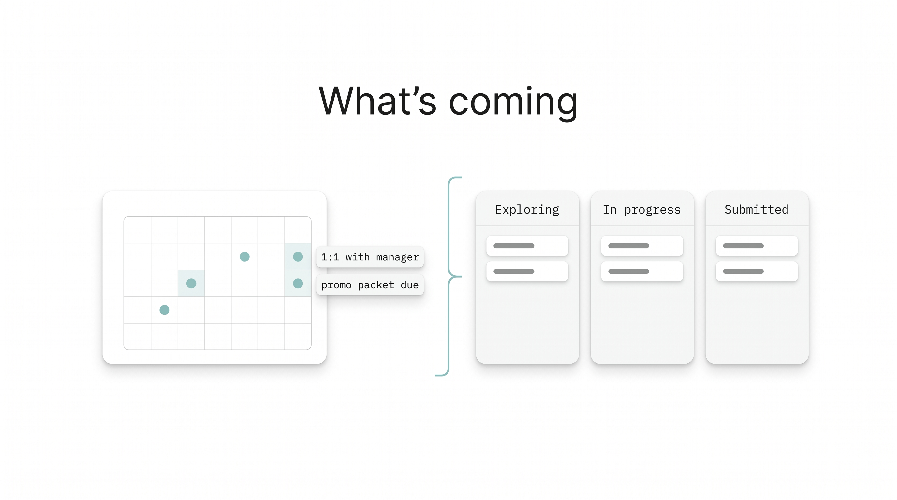<br/><sub><b>2 · See what's coming.</b> The calendar and pipeline board make upcoming conversations, submission dates, and follow-ups visible next to the rest of the workspace.</sub></td>
</tr>
<tr>
<td width="50%" valign="top">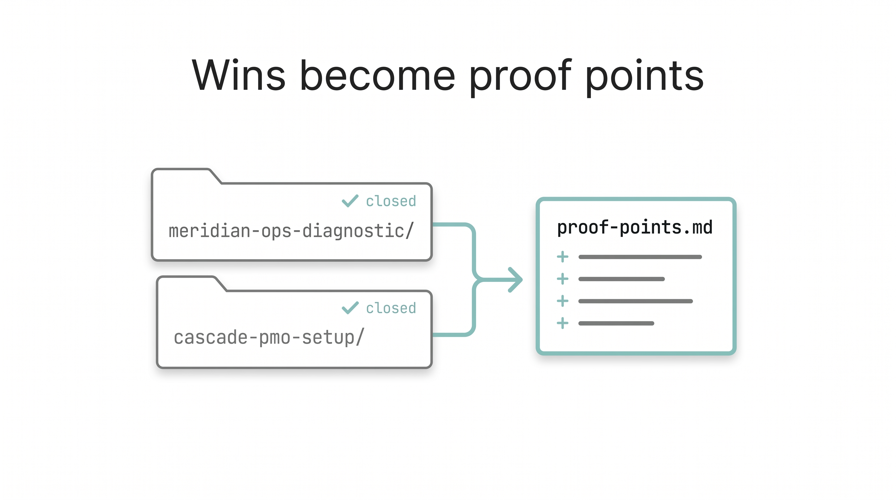<br/><sub><b>3 · Gather evidence.</b> Completed projects already contain your wins; harvest passes turn them into proof points and a running impact record instead of a panic the week before review season.</sub></td>
<td width="50%" valign="top">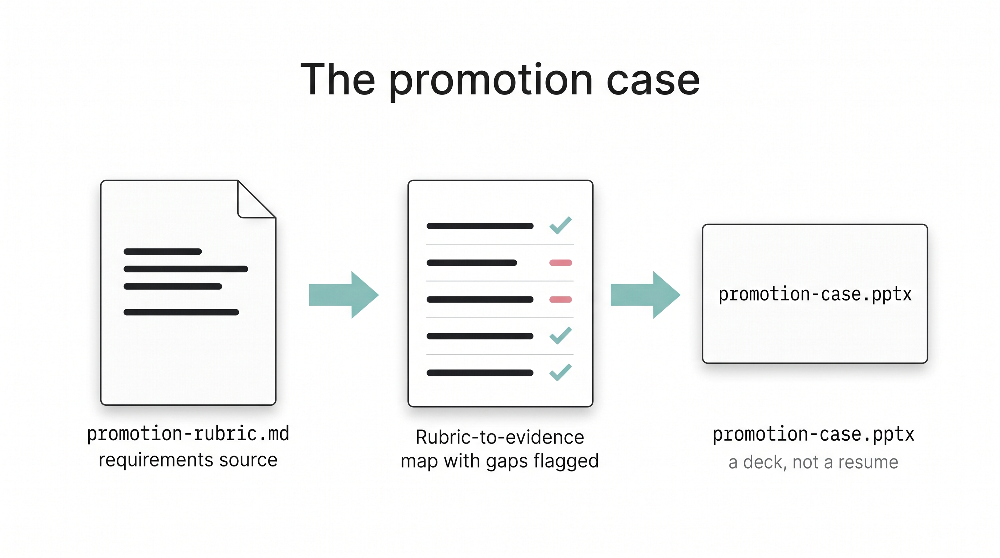<br/><sub><b>4 · Run a case.</b> An internal promotion case works like any evidence-backed application: the rubric becomes the requirements source, gaps become a plan, and the final material can be a deck rather than a resume.</sub></td>
</tr>
<tr>
<td width="50%" valign="top">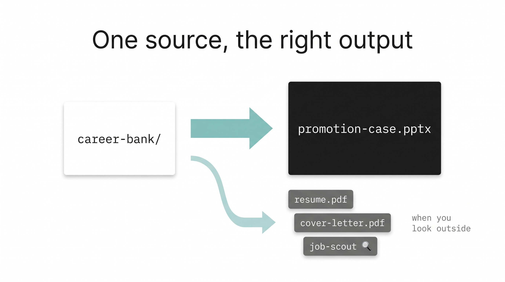<br/><sub><b>5 · Produce materials.</b> A promotion case exports as a deck; when you do look outside, the same system can produce ATS-aware resume and cover-letter files and scouts public job feeds.</sub></td>
<td width="50%" valign="top">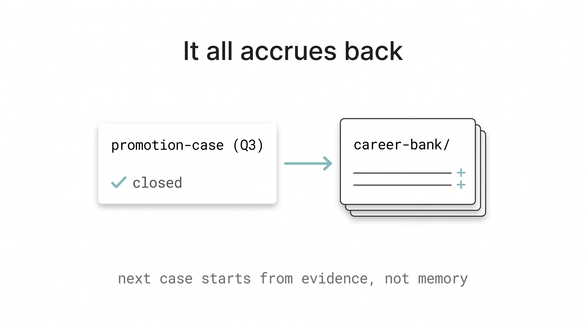<br/><sub><b>6 · Keep the record.</b> Everything accrues back into the bank, so the next case starts from evidence instead of memory.</sub></td>
</tr>
</table>

## At a glance

This is the full capability catalog. AgentFrame does not rebuild every production tool from scratch: deck generation, advanced visuals, video composition, prose cleanup, and deep research come from community projects that already do those jobs well. AgentFrame adds its own process and adaptations, while each vendored skill keeps its upstream source and refresh path nearby. The process files and templates are AgentFrame's own and have been refined through real work.

### Skills

| Skill | What it does | Provenance |
|---|---|---|
| `agentframe-structure` | Safely changes flows, deliverable types, defaults, and ownership boundaries | Internal |
| `browser-harness` | Runs local CDP-driven browser workflows | Vendored |
| `d2-diagrams` | Renders deterministic SVG diagrams | Internal (pinned D2 binary vendored) |
| `deep-research` | Architect → specialist → synthesis research on the agent's own tools | Internal (prompts adapted from upstream) |
| `deliverable-harvest` | Mines finished projects for earned template and process improvements | Internal |
| `deliverable-scaffolding` | Creates deliverable instances with the correct shape and frontmatter | Internal |
| `doc-export` | Produces ATS-safe resume and cover-letter files keyed to the destination system | Adapted |
| `docx` | Creates, inspects, and edits Word documents | Vendored |
| `extract-design` | Measures a website's design language via the `designlang` CLI | Vendored |
| `humanizer` | Detects and removes common AI-writing patterns | Vendored |
| `hyperframes` | HTML-to-video composition: Studio, CLI, engine, and routed video skills | Vendored |
| `job-scout` | Sweeps public ATS feeds against the career search profile, login-free | Adapted |
| `open-design` | Local-first advanced image and deck runtime | Vendored |
| `ppt-master` | Converts sources into designed SVG pages and native-editable PowerPoint decks | Vendored |
| `pptx` | Inspects, validates, and performs native PowerPoint edits | Vendored |
| `project-consolidate` | Archives stale project detail and promotes durable context | Internal |
| `system-improvement` | Applies scoped system patches with verification and audit discipline | Internal |
| `upstream-sync` | Adopts upstream AgentFrame changes without overwriting the personal layer | Internal |
| `voice-harvest` | Turns finished work and edit deltas into corpus examples and contrastive pairs | Internal |

Vendored skills keep a skill-local `VENDOR.md` with the upstream source and refresh procedure, so pulling the latest community version is a documented step. The live index is [`system/skills/README.md`](system/skills/README.md).

### Processes

All AgentFrame-owned. Each loads on demand when the work reaches it.

| Process | What it gives the agent |
|---|---|
| `bounded-autonomy` | Goal contracts, budgets, checkpoints, reviewer gates, and stop rules |
| `browser-fallback` | A controlled browser route when a supported API, connector, or CLI is unavailable |
| `career-harvest` | Promotion of real project wins into proof points, stories, and resume-bank bullets |
| `composio-notes` | Connected-workspace publishing and performance-capture conventions |
| `deck-production` | Central deck routing with PPT Master as the default for new PowerPoint work |
| `deliverable-versioning` | Head pointers, immutable snapshots, and revision judgment |
| `diagram-production` | Static graph-shaped explainers through D2 |
| `flow-authoring` | The standard for adding or reshaping project flows |
| `humanizer-integration` | A calibrated humanization pass where a template calls for it |
| `image-production` | Path selection across generated imagery, HTML visuals, and Open Design |
| `knowledge-base` | Source ingestion, living knowledge files, archives, and consolidation rules |
| `ready-event` | Readiness mechanics and the post-ready judgment checklist |
| `operator-context-setup` | First-run generation of positioning, profile, career, and voice surfaces |
| `preview-server` | Start-or-open behaviour, deep links, and preview hygiene for the dashboard |
| `process-authoring` | The standard for reusable process files |
| `project-automation` | Project-owned contracts, lifecycle, deployment joins, and result verification for standing work |
| `project-frontmatter` | Canonical project state, tracker schema, overrides, and drift checks |
| `research-and-signals` | Kickoff context scans and research-method selection |
| `substack-publishing` | Draft preparation, editor handoff, and live-result reconciliation |
| `technical-build` | External-repository orchestration and graduation |
| `video-production` | Talking-head, HyperFrames, generated-asset, and hybrid video routes |
| `voice-mini-retro` | The ready-time eligibility gate for harvesting meaningful voice edits |
| `voice-setup` | Corpus mining, taste interview, and initial voice-system setup |

The live catalog with load triggers is [`library/process/README.md`](library/process/README.md).

### Deliverable templates

All AgentFrame-owned, shaped by real use.

| Where | Templates |
|---|---|
| Shared (`library/deliverables/`) | design-language · image-prompts · video-spec · closeout-retro · system-retro · the generic `_meta` deliverable shape |
| Marketing pack | body-copy · business-brief · campaign-architecture · campaign-brief · post-final · research-artifact · slide-copy · substack-essay |
| Project-mgmt pack | charter · raid-log · decision-log · stakeholder-map · workback-schedule |
| Careers pack | resume · cover-letter · jd-map · company-brief |

## Architecture

<p align="center">
  
</p>

The structure follows a few rules that have kept it from turning into a second job to maintain:

- **The default project is domain-neutral.** `project-mgmt/open-flow` contributes no domain fields and no mandatory governance ceremony.
- **Specialization is additive.** Packs declare vocabulary, templates, valid verbs, and routes; the core engine stays blind to what a project is about.
- **Files own working truth.** Markdown and media hold project state, context, decisions, and outputs. SQLite is reserved for the append-only system-change audit.
- **Sources and knowledge are different things.** Immutable inputs live in `sources/`; distilled working context lives in `knowledge/`.
- **Prose owns judgment; mechanisms guarantee invariants.** The agent decides what good work is. The CLI and hooks protect state, exports, and repeatable gates.
- **The dashboard is a reader.** It never becomes a competing state owner. It only shows what's already available in markdown.
- **Templates hold the reusable knowledge.** Skills and runtimes can be replaced without rewriting the deliverable library.

## The Workspace Dashboard

`python system/server/run.py --daemon` starts or reuses the local server and opens the workspace UI (you can also just ask the agent to turn it on). It reads the workspace files directly, so it does not need a model, an API key, or a second database.

<table>
<tr>
<td width="50%" valign="top">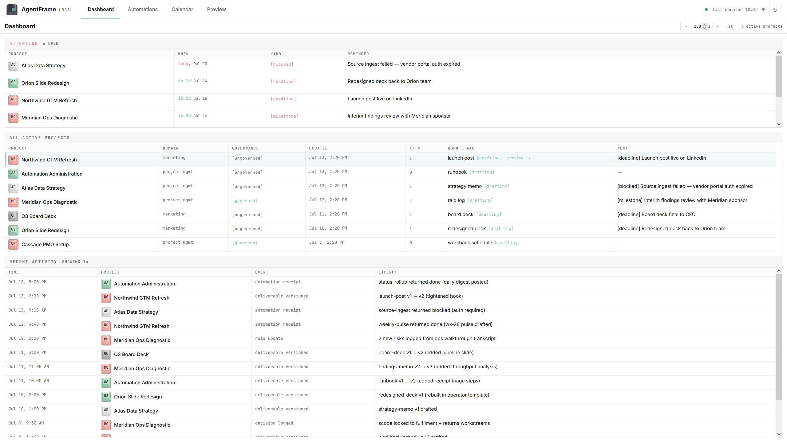<br/><sub><b>Surface · Dashboard.</b> Active projects, attention items, and recent activity, read straight from the workspace files.</sub></td>
<td width="50%" valign="top">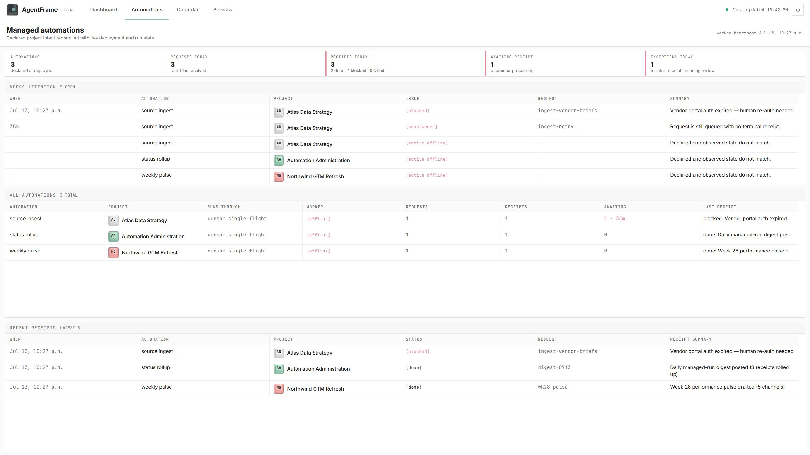<br/><sub><b>Surface · Automations.</b> Read-only pulse of declared automations reconciled against live runtime state, receipts, and drift.</sub></td>
</tr>
<tr>
<td width="50%" valign="top">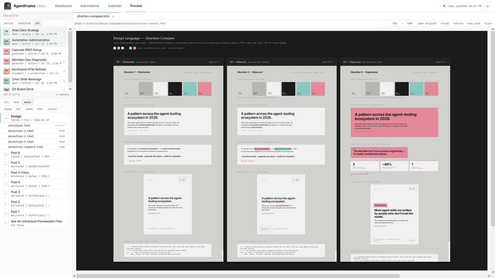<br/><sub><b>Surface · Preview.</b> An IDE-style workspace with tabs and splits for markdown, decks, PDFs, images, and video.</sub></td>
<td width="50%" valign="top">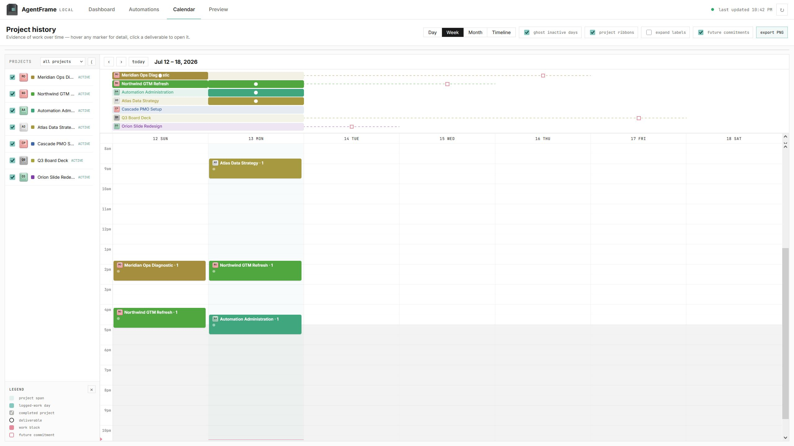<br/><sub><b>Calendar · Week.</b> Work blocks derived from logged activity; the day view zooms into this.</sub></td>
</tr>
<tr>
<td width="50%" valign="top">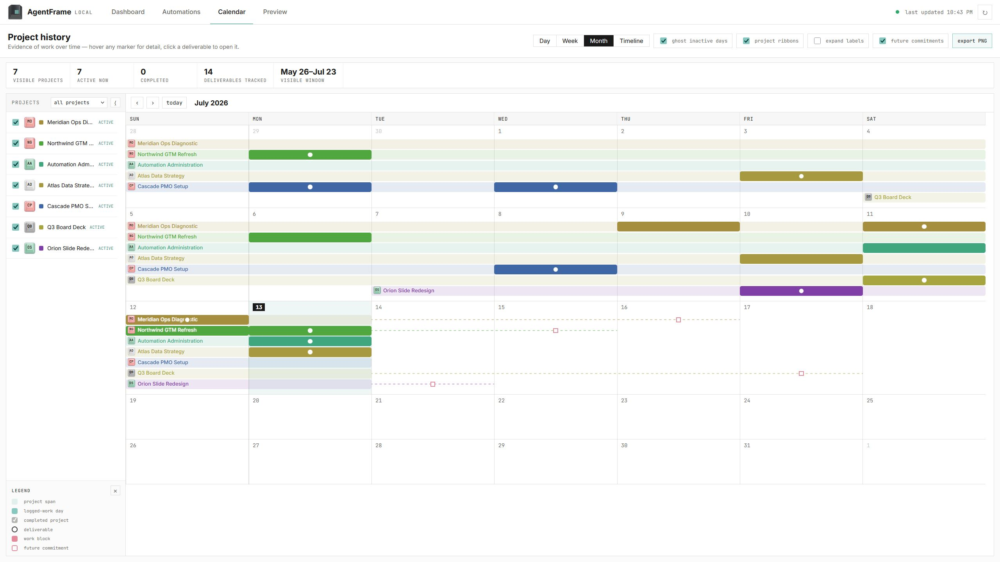<br/><sub><b>Calendar · Month.</b> Deliverable and shipped-media markers across the month, with hover previews.</sub></td>
<td width="50%" valign="top">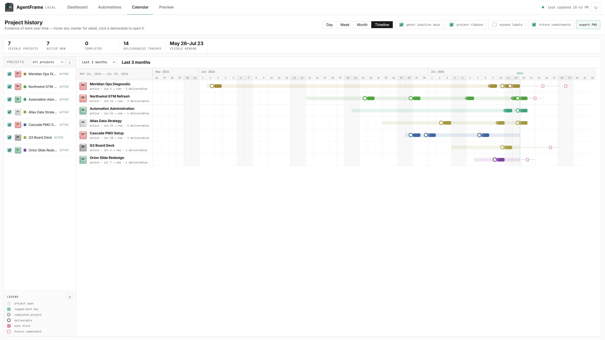<br/><sub><b>Calendar · Timeline.</b> A multi-month swimlane across projects, active-first.</sub></td>
</tr>
</table>

Beyond what the tour shows:

- Markdown, text, HTML, image, PDF, video, PPTX, and DOCX viewing in the preview workspace
- Deliverable and shipped-media markers with hover previews across the calendar
- Completed-project history and print/PDF calendar output
- File watching and LiveReload for production work

## Repository map

```text
agentframe/
├── AGENTS.md                   # stable task classifier
├── AGENTS.operator.md          # project execution and routing
├── AGENTS.builder.md           # system architecture and maintenance
├── AGENTS.daemon.md            # unattended managed-run overlay
├── library/
│   ├── context/                 # operator, people, channel, career, and voice context
│   ├── deliverables/            # shared deliverable templates
│   ├── domains/                 # marketing, project-mgmt, careers
│   ├── process/                 # flows and on-demand procedures
│   └── assets/                  # logos and reusable deck templates
├── system/
│   ├── af.py                    # deterministic state-transition CLI
│   ├── audit/                   # append-only system-change audit
│   ├── browser/                 # browser runtime and recipes
│   ├── daemon/                  # local managed-automation host and queue protocol
│   ├── harnesses/               # native skill projections and hook-wiring contract
│   ├── hooks/                   # deterministic production guards
│   ├── research/                # Gemini deep-research runtime
│   ├── server/                  # Workspace Dashboard and preview server
│   ├── skills/                  # owned and vendored capabilities
│   ├── tests/                   # CLI, guards, dashboard, and runtime tests
│   └── tools/                   # pinned local tool binaries
└── workspace/
    ├── projects/                # open-flow and structured projects
    └── pipeline/                # career board and case folders
```

## Integrations

AgentFrame runs locally, and the coding agent you already use provides the model. External services add optional production capabilities, so environment keys are only needed for the tools that use them.

| Integration or runtime | Used for |
|---|---|
| Gemini | Deep Research and image generation through the local helper |
| Composio | Connected-workspace context, publishing, and performance capture |
| Open Design | Local-first advanced visual and deck production |
| PPT Master | Native-editable deck generation from source material and SVG |
| HyperFrames | HTML-to-video composition and rendering |

## Auditability

Every trail has one owner:

| Trail | Lives in |
|---|---|
| Current project state | `project.md` / `application.md` frontmatter |
| Material project events | `activity.md` |
| What changed between versions | the version files themselves |
| Low-volume system changes (template patches, runtime changes, migrations) | `system/audit/agentframe.db` |
| Schema, file, export, and pack-rule checks | `python system/af.py doctor`; it reports drift and never silently fixes it |

Git carries the version history of the reusable system; personal work stays local and gitignored.

## Contributing

PRs for templates, process improvements, domain packs, skills, and runtime fixes are welcome. Open an issue if you spot any. 

## References and lineage

- [agentframe-marketing](https://github.com/situhacks/agentframe-marketing), the frozen marketing-only predecessor
- [Composio](https://composio.dev)
- [Open Design](https://github.com/nexu-io/open-design)
- [PPT Master](https://github.com/hugohe3/ppt-master)
- [HyperFrames](https://github.com/heygen-com/hyperframes)
- [design-extract](https://github.com/Manavarya09/design-extract)
- [humanizer](https://github.com/blader/humanizer)
- [DeepResearch Bench](https://huggingface.co/spaces/muset-ai/DeepResearch-Bench-Leaderboard)
- [LunonAI deep research](https://github.com/LunonAI/lunon-deep-research)
- [deer-flow](https://github.com/bytedance/deer-flow)
- [open_deep_research](https://github.com/langchain-ai/open_deep_research)

## License

MIT. See [`LICENSE`](LICENSE).

## Contact

Built by Brandon Situ over many weekends, with more weekends probably coming.

- [LinkedIn](https://www.linkedin.com/in/brandonsitu/)
- Email: brandonzsitu@gmail.com
