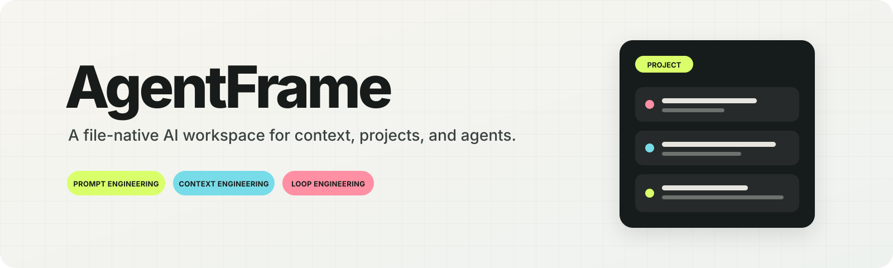

# AgentFrame



AgentFrame is the workspace I use to run long projects with coding agents. It works with Claude Code, Codex, Cursor, VS Code, Antigravity, or anything else that can read files, because the projects, context, deliverables, decisions, and feedback loops are all plain files too. A fresh agent can read the workspace, pick up the work where I left it, and spend its context on the project instead of making me explain everything again.

I'm not a software engineer. I built this because I use AI for real work every day, and after enough broken chat threads, repeated briefings, and folders full of mystery finals, I wanted a setup that could actually survive a project. Every template and process in here comes from work I have run through it. It's free to fork, so take whatever is useful for your own setup.

<p align="center">
  <a href="LICENSE"></a>
  
  
</p>

## Table of contents

- [Why this exists](#why-this-exists)
- [Key features](#key-features)
- [Quick start](#quick-start)
- [What it can run](#what-it-can-run)
- [A real project, step by step](#a-real-project-step-by-step)
- [At a glance](#at-a-glance)
- [Architecture](#architecture)
- [The Workspace Dashboard](#the-workspace-dashboard)
- [Repository map](#repository-map)
- [Integrations](#integrations)
- [Auditability](#auditability)
- [Design constraints](#design-constraints)
- [Contributing](#contributing)
- [References and lineage](#references-and-lineage)
- [License](#license)
- [Contact](#contact)

## Why this exists

The first version of AgentFrame was a marketing system. I was trying to run campaigns in raw chat windows, which meant decisions drifted between sessions, drafts forked without a clear final, and every new chat started with me giving the same briefing again. Moving the work into structured files fixed enough of that mess that I ended up shipping a whole campaign series through it.

Then I kept using the marketing system for work that had nothing to do with marketing. I ran PowerPoint redesigns through it, made document deliverables, and did small research jobs by pretending they were all "campaigns" so the structure would still fit. That worked surprisingly well, which made the problem pretty obvious: the useful part was never the marketing language. It was the way the system kept project state, versioned the work, and carried the right context into the next step.

<!-- IMAGE STUB · slot: realization-hero · shows: the context-management core revealed beneath the marketing-specific shell, in the same visual family as the release post -->

So I rebuilt AgentFrame around projects. Marketing is still there, but now it is one domain pack beside project management and careers, while the core handles the things all of them share: context, state, deliverables, and the path between them. That rebuild also gave me the parts I care about most now, including long-horizon memory that can consolidate without forgetting, a voice system trained on my actual edits, and deliverables that keep a real version trail.

The original marketing-only system is frozen at [agentframe-marketing](https://github.com/situhacks/agentframe-marketing). This repository is its successor.

## Key features

AgentFrame keeps three layers on the same files. Prompt engineering gives the agent reusable personas, templates, and processes. Context engineering decides which of those files the agent should read for the work in front of it. Loop engineering is the part I am still exploring: bounded runs where the agent can keep working toward a defined result without me sitting in the chat the whole time. Any coding agent that reads files can run all three.

<!-- IMAGE STUB · slot: three-layers · shows: prompt / context / loop engineering as one visual, context as the core layer -->

### Context engineering without the re-briefing

**The project reconstructs from disk.** After a memory compaction, a provider switch, or a month away, a fresh agent reads the project files and continues from the same state. I do not need to write a catch-up paragraph or upload the brief again.

**Sources and working knowledge stay separate.** Transcripts and briefs land in `sources/` and never get edited. The agent maintains what it has learned from them in `knowledge/`, and when that working context gets too big, a consolidation pass archives the resolved detail so the active files stay useful without deleting the history.

**The workspace only loads what the task needs.** The active persona points to the project, the project points to its flow, and the flow points to the process for the current step. Skills stay out of context until the work calls for them, so the workspace can get large without every chat carrying all of it.

<!-- IMAGE STUB · slot: context-graph · shows: D2 mini-diagram, project → flow → process → skill, each loading only what the step needs -->

### Prompt engineering built from real work

**Templates and processes are the part meant to last.** Every deliverable shape and workflow in the library was refined on work I actually ran. The model and the tools around them can change without taking that knowledge with them.

**The voice system learns from my edits.** It reads complete pieces I published, uses a different register for each channel, and compares agent drafts against my rewrites to learn the moves I keep making by hand. I am still refining it, but it gets better as more real work runs through the system.

**Domain packs only exist where repeated work has earned the extra structure.** Marketing, project management, and careers ship today. Adding another domain means adding its templates and a descriptor rather than rewriting the core. My read is that the model companies are moving toward a similar shape, with specialised packs on top of a general platform; Anthropic's Claude for Financial Services is one example. AgentFrame uses that pattern in a local workspace.

<!-- IMAGE STUB · slot: voice-pair · shows: one real contrastive pair, a generic AI line beside the operator's rewrite, rendered as a styled snippet -->

### Commands handle the bookkeeping

**Project state changes through commands.** Models are good at research, synthesis, and drafting, but I do not trust one to remember the exact bookkeeping steps months into a project. `system/af.py` handles creation, versioning, locking, publishing, and doctor checks, then gives the work back to the agent for the part that needs judgment.

**Deliverables keep their own version trail.** Replacement-shaped revisions become immutable snapshots, the project always points at the current version, and lock gates run before delivery. When the destination needs a real file, the export is tracked too, so I can see what changed and why without reconstructing it from chat history.

**The workspace records what happened as part of the work.** Activity logs and version notes cover projects, while an append-only audit database records system changes. `af doctor` reports drift without silently fixing it. The same trail feeds the dashboard and gives the harvest passes something concrete to learn from later.

<!-- IMAGE STUB · slot: spine-flow · shows: D2 flow, draft → version → lock → gate → publish, with the paper trail written underneath each step -->

### Self-improvement when the work earns it

**Finished work can feed the system back.** When a project closes, harvest passes compare the drafts with my manual edits and the friction logged along the way. They propose changes to templates, processes, or the voice corpus, but nothing updates itself automatically. I decide when there is enough evidence to change the system.

**Loop engineering is still an experiment.** A bounded run defines the goal, the evidence that would count as done, its iteration budget, and the points where a reviewer checks the work. Today that is one process file, [`bounded-autonomy.md`](library/process/bounded-autonomy.md), and I expect the shape to change as I use it more.

### What I reused

I did not rebuild every production tool from scratch. Deck generation, advanced visuals, video composition, prose cleanup, and deep research come from community projects that already do those jobs well. AgentFrame keeps the upstream source and refresh path beside each vendored skill, then layers its own tweaks on top. The full split between vendored and internal work is in [At a glance](#at-a-glance).

### The Workspace Dashboard

There is also a dashboard for projects, attention items, the calendar, and the timeline, all rendered from the same markdown the agents read. Honestly, I mostly use it for the quick view (and a little vanity), but I like that the workspace is coherent enough to become an interface without adding a second database or making another model call. Details are in [The Workspace Dashboard](#the-workspace-dashboard).

<!-- IMAGE STUB · slot: dashboard-hero · shows: one Workspace Dashboard screenshot with active projects, attention queue, and calendar -->

## Quick start

1. Clone the repository:

   ```bash
   git clone https://github.com/situhacks/agentframe.git
   cd agentframe
   ```

2. Open the folder in Claude Code, Codex, Cursor, VS Code, Antigravity, or another coding agent that can read and write the workspace.

3. Copy `.env.example` to `.env` if you want the optional Gemini or Composio integrations. The workspace, CLI, project system, and dashboard all run without API keys.

4. Tell the agent: **"Swap to Operator and start a new project."** Under the hood that's:

   ```bash
   python system/af.py new-project my-project --domain project-mgmt --flow open-flow
   ```

   The agent proposes a plan scaled to your objective. Nothing governed is created unless the work needs it.

5. Optionally, start the Workspace Dashboard:

   ```bash
   pip install -r system/server/requirements.txt
   python system/server/run.py --daemon
   ```

### Modes

Two generated `AGENTS.md` personas with a hard ownership boundary:

- **Operator** runs projects and career work under `workspace/` and reads the system on demand.
- **Builder** evolves the templates, packs, processes, personas, CLI, and runtime under `library/` and `system/`.

Mode swaps copy the canonical persona and append the transition to the local audit database in one operation, and the CLI refuses Operator state transitions while Builder is active.

### Pulling upstream changes

Personal context, projects, pipeline data, and the audit database are gitignored, so your working layer never collides with updates. In Builder mode, ask the agent to **"pull upstream AgentFrame updates."** The sync skill walks changes commit by commit, or applies a reviewed bulk migration, without touching the personal layer.

## What it can run

Three domain packs and two work topologies ship today.

| Surface | What it is for | Default shape |
|---|---|---|
| **Open project** | The domain-neutral starting point for research, planning, building, writing, or analysis; use it for any objective the model and its tools can handle | `project-mgmt` + `open-flow`; no fixed phase ladder, no mandatory governance files |
| **Governed project** | Longer engagements that benefit from a charter, RAID log, stakeholder map, decision log, and workback schedule | `project-mgmt` + opt-in governance flow |
| **Marketing project** | Research, campaign architecture, copy, visuals, video, decks, publishing, and performance capture | `marketing` + open flow or an opt-in phase ladder |
| **Career workspace** | Ongoing career context, internal progression, promotion evidence, and structured application cases | Career bank + calendar/pipeline + case folders |

The open project is the default because most knowledge work fits inside a project before it needs anything more specialised. You do not have to design a domain pack before AgentFrame can help with the work. Packs are for the jobs you repeat often enough to justify a stronger shape.

### Technical builds without splitting the brain

When a project turns into a proof of concept or an application, the code lives in its own repository while AgentFrame keeps the plan, sources, decisions, and build log. Once that repository can stand on its own, it receives the context it needs and AgentFrame stops orchestrating the build.

## A real project, step by step

The content changes between packs, but the project path stays familiar: bring the context in, version the work as it changes, deliver it through a gate, and keep what the next project should learn.

### A governed project

The project-management pack takes a charter and turns it into living context the agent maintains for months.

<table>
<tr>
<td width="50%" valign="top"><!-- IMAGE STUB · pm-walkthrough-01 · shows: Operator kickoff, scaffold from the PM skeleton, charter lands in sources/ --><br/><sub><b>1 · Kickoff.</b> Tell the agent to start a new governed project. It scaffolds the workspace from the pack skeleton and files your charter into the project's <code>sources/</code>.</sub></td>
<td width="50%" valign="top"><!-- IMAGE STUB · pm-walkthrough-02 · shows: the four governance files derived from the charter under knowledge/ --><br/><sub><b>2 · Derive the knowledge base.</b> From the charter, the agent derives living context files under <code>knowledge/</code>: a RAID log, a stakeholder map, a decision log, and a workback schedule.</sub></td>
</tr>
<tr>
<td width="50%" valign="top"><!-- IMAGE STUB · pm-walkthrough-03 · shows: living maintenance, RAID updates from a meeting transcript, decisions appending --><br/><sub><b>3 · Maintain and consolidate.</b> Meeting transcripts land in <code>sources/</code>; the agent updates the RAID log, appends decisions, and re-plans the schedule. On long projects, a consolidation pass archives resolved items so active files stay lean without losing history.</sub></td>
<td width="50%" valign="top"><!-- IMAGE STUB · pm-walkthrough-04 · shows: a versioned deliverable draft with its -v{N} snapshot trail --><br/><sub><b>4 · Draft deliverables.</b> Findings, memos, and decks are drafted in your voice from the deliverable library, and every replacement-shaped revision becomes an immutable <code>-v{N}</code> snapshot.</sub></td>
</tr>
<tr>
<td width="50%" valign="top"><!-- IMAGE STUB · pm-walkthrough-05 · shows: lock gate passing + a deck export landing in the operator's own template --><br/><sub><b>5 · Deliver.</b> Deliverables pass lock criteria before delivery is recorded, including deck exports in your own PowerPoint template when the destination needs a file.</sub></td>
<td width="50%" valign="top"><!-- IMAGE STUB · pm-walkthrough-06 · shows: the closeout harvest proposing template/voice updates --><br/><sub><b>6 · Learn.</b> Closeout harvests your manual edits and workflow friction into proposed template, process, and voice improvements.</sub></td>
</tr>
</table>

### A marketing campaign

The marketing pack has the most visual production because it is where this workspace started.

<table>
<tr>
<td width="50%" valign="top"><br/><sub><b>1 · Kickoff.</b> Scaffold the project, load operator context, gather live signals, and choose the research depth.</sub></td>
<td width="50%" valign="top"><br/><sub><b>2 · Research.</b> Use Gemini Deep Research or the native multi-role research skill and keep the cited artifact in the project.</sub></td>
</tr>
<tr>
<td width="50%" valign="top"><br/><sub><b>3 · Draft.</b> Build from templates, the gold voice corpus, register guidance, and project evidence. Every replacement-shaped revision becomes a snapshot.</sub></td>
<td width="50%" valign="top"><br/><sub><b>4 · Produce.</b> Route images, diagrams, decks, carousels, or video through the appropriate production process.</sub></td>
</tr>
<tr>
<td width="50%" valign="top"><br/><sub><b>5 · Deliver.</b> Deterministic gates verify locked copy and landed exports before publishing is recorded.</sub></td>
<td width="50%" valign="top"><br/><sub><b>6 · Learn.</b> Harvest real edits and workflow friction into proposed voice, template, and process improvements.</sub></td>
</tr>
</table>

### A career workspace

The careers pack treats a career as a long project, starting with the work you are already doing rather than waiting until you need a new job.

<table>
<tr>
<td width="50%" valign="top"><!-- IMAGE STUB · career-walkthrough-01 · shows: the career bank with role expectations, KPIs, proof points, and stories --><br/><sub><b>1 · Build the career bank.</b> Role expectations, KPIs, proof points, resume bullets, stories, manager context, promotion rubrics, and cycle dates live as durable files.</sub></td>
<td width="50%" valign="top"><!-- IMAGE STUB · career-walkthrough-02 · shows: the pipeline board + calendar with upcoming conversations and dates --><br/><sub><b>2 · See what's coming.</b> The calendar and pipeline board make upcoming conversations, submission dates, and follow-ups visible next to the rest of the workspace.</sub></td>
</tr>
<tr>
<td width="50%" valign="top"><!-- IMAGE STUB · career-walkthrough-03 · shows: evidence harvested from completed projects into the bank --><br/><sub><b>3 · Gather evidence.</b> Completed projects already contain your wins; harvest passes turn them into proof points and a running impact record instead of a panic the week before review season.</sub></td>
<td width="50%" valign="top"><!-- IMAGE STUB · career-walkthrough-04 · shows: a promotion case built as a rubric map + evidence + gaps plan --><br/><sub><b>4 · Run a case.</b> An internal promotion case works like any evidence-backed application: the rubric becomes the requirements source, gaps become a plan, and the final material can be a deck rather than a resume.</sub></td>
</tr>
<tr>
<td width="50%" valign="top"><!-- IMAGE STUB · career-walkthrough-05 · shows: ATS-safe resume/cover exports keyed to the destination system --><br/><sub><b>5 · Produce materials.</b> The same substrate handles external applications when you need it to: ATS-aware resume and cover-letter exports, and login-free job scouting from public feeds.</sub></td>
<td width="50%" valign="top"><!-- IMAGE STUB · career-walkthrough-06 · shows: dashboard timeline view of career activity across months --><br/><sub><b>6 · Keep the record.</b> Everything accrues back into the bank, so the next case starts from evidence instead of memory.</sub></td>
</tr>
</table>

## At a glance

This is the full capability catalog. Skills name where they came from because AgentFrame uses existing community work when it already does the job well. The process files and templates are AgentFrame's own, built from projects that ran through the workspace.

### Skills

| Skill | What it does | Provenance |
|---|---|---|
| `agentframe-structure` | Safely changes flows, deliverable types, defaults, and ownership boundaries | Internal |
| `browser-harness` | Runs local CDP-driven browser workflows | Vendored |
| `d2-diagrams` | Renders deterministic SVG diagrams | Internal (pinned D2 binary vendored) |
| `deep-research` | Architect → specialist → synthesis research on the agent's own tools | Internal (prompts adapted from upstream) |
| `deliverable-harvest` | Mines finished projects for earned template and process improvements | Internal |
| `deliverable-scaffolding` | Creates deliverable instances with the correct shape and frontmatter | Internal |
| `doc-export` | Produces ATS-safe resume and cover-letter files keyed to the destination system | Adapted |
| `docx` | Creates, inspects, and edits Word documents | Vendored |
| `extract-design` | Measures a website's design language via the `designlang` CLI | Vendored |
| `humanizer` | Detects and removes common AI-writing patterns | Vendored |
| `hyperframes` | HTML-to-video composition: Studio, CLI, engine, and routed video skills | Vendored |
| `job-scout` | Sweeps public ATS feeds against the career search profile, login-free | Adapted |
| `open-design` | Local-first advanced image and deck runtime | Vendored |
| `ppt-master` | Converts sources into designed SVG pages and native-editable PowerPoint decks | Vendored |
| `pptx` | Inspects, validates, and performs native PowerPoint edits | Vendored |
| `project-consolidate` | Archives stale project detail and promotes durable context | Internal |
| `system-improvement` | Applies scoped system patches with verification and audit discipline | Internal |
| `upstream-sync` | Adopts upstream AgentFrame changes without overwriting the personal layer | Internal |
| `voice-harvest` | Turns finished work and edit deltas into corpus examples and contrastive pairs | Internal |

Vendored skills keep a skill-local `VENDOR.md` with the upstream source and refresh procedure, so pulling the latest community version is a documented step. The live index is [`system/skills/README.md`](system/skills/README.md).

### Processes

All AgentFrame-owned. Each loads on demand when the work reaches it.

| Process | What it gives the agent |
|---|---|
| `bounded-autonomy` | Goal contracts, budgets, checkpoints, reviewer gates, and stop rules |
| `browser-fallback` | A controlled browser route when a supported API, connector, or CLI is unavailable |
| `career-harvest` | Promotion of real project wins into proof points, stories, and resume-bank bullets |
| `composio-notes` | Connected-workspace publishing and performance-capture conventions |
| `deck-production` | Central deck routing with PPT Master as the default for new PowerPoint work |
| `deliverable-versioning` | Head pointers, immutable snapshots, and revision judgment |
| `diagram-production` | Static graph-shaped explainers through D2 |
| `flow-authoring` | The standard for adding or reshaping project flows |
| `humanizer-integration` | A calibrated humanization pass where a template calls for it |
| `image-production` | Path selection across generated imagery, HTML visuals, and Open Design |
| `knowledge-base` | Source ingestion, living knowledge files, archives, and consolidation rules |
| `lock-event` | Lock mechanics and the post-lock judgment checklist |
| `operator-context-setup` | First-run generation of positioning, profile, career, and voice surfaces |
| `preview-server` | Start-or-open behaviour, deep links, and preview hygiene for the dashboard |
| `process-authoring` | The standard for reusable process files |
| `project-frontmatter` | Canonical project state, tracker schema, overrides, and drift checks |
| `research-and-signals` | Kickoff context scans and research-method selection |
| `substack-publishing` | Draft preparation, editor handoff, and live-result reconciliation |
| `technical-build` | External-repository orchestration and graduation |
| `video-production` | Talking-head, HyperFrames, generated-asset, and hybrid video routes |
| `voice-mini-retro` | The lock-time eligibility gate for harvesting meaningful voice edits |
| `voice-setup` | Corpus mining, taste interview, and initial voice-system setup |

The live catalog with load triggers is [`library/process/README.md`](library/process/README.md).

### Deliverable templates

All AgentFrame-owned, shaped by real use.

| Where | Templates |
|---|---|
| Shared (`library/deliverables/`) | design-language · image-prompts · video-spec · closeout-retro · system-retro · the generic `_meta` deliverable shape |
| Marketing pack | body-copy · business-brief · campaign-architecture · campaign-brief · post-final · research-artifact · slide-copy · substack-essay |
| Project-mgmt pack | charter · raid-log · decision-log · stakeholder-map · workback-schedule |
| Careers pack | resume · cover-letter · jd-map · company-brief |

## Architecture

<!-- IMAGE STUB · slot: architecture-flow · shows: D2 flow diagram, coding agent → active persona → workspace state → selected flow → processes/templates → skills/tools, with the dashboard reading from the same files; legible to non-technical readers -->

The structure follows a few rules that have kept it from turning into a second job to maintain:

- **The default project is domain-neutral.** `project-mgmt/open-flow` contributes no domain fields and no mandatory governance ceremony.
- **Specialization is additive.** Packs declare vocabulary, templates, valid verbs, and routes; the core engine stays blind to what a project is about.
- **Files own working truth.** Markdown and media hold project state, context, decisions, and outputs. SQLite is reserved for the append-only system-change audit.
- **Sources and knowledge are different things.** Immutable inputs live in `sources/`; distilled working context lives in `knowledge/`.
- **Prose owns judgment; mechanisms guarantee invariants.** The agent decides what good work is. The CLI and hooks protect state, exports, and repeatable gates.
- **The dashboard is a reader.** It never becomes a competing state owner.
- **Templates hold the reusable knowledge.** Skills and runtimes can be replaced without rewriting the deliverable library.

## The Workspace Dashboard

`python system/server/run.py --daemon` starts or reuses the local server and opens the workspace UI. It reads the workspace files directly, so it does not need a model, an API key, or a second database.

<!-- IMAGE STUB · slot: dashboard-tour · shows: 2-3 dashboard screenshots of the dashboard home, calendar/timeline, and preview workspace -->

What it provides:

- A dashboard of active projects, attention items, and recent activity
- Day, week, and month calendar views
- A multi-month swimlane timeline with active-first sorting
- Work blocks derived from actual logged activity
- Deliverable and shipped-media markers with hover previews
- An IDE-style preview workspace with tabs and splits
- Markdown, text, HTML, image, PDF, video, PPTX, and DOCX viewing
- Completed-project history and print/PDF calendar output
- File watching and LiveReload for production work

## Repository map

```text
agentframe/
├── AGENTS.md                   # generated active persona
├── AGENTS.operator.md          # project execution and routing
├── AGENTS.builder.md           # system architecture and maintenance
├── library/
│   ├── context/                 # operator, people, channel, career, and voice context
│   ├── deliverables/            # shared deliverable templates
│   ├── domains/                 # marketing, project-mgmt, careers
│   ├── process/                 # flows and on-demand procedures
│   └── assets/                  # logos and reusable deck templates
├── system/
│   ├── af.py                    # deterministic state-transition CLI
│   ├── audit/                   # append-only system-change audit
│   ├── browser/                 # browser runtime and recipes
│   ├── hooks/                   # deterministic production guards
│   ├── research/                # Gemini deep-research runtime
│   ├── server/                  # Workspace Dashboard and preview server
│   ├── skills/                  # owned and vendored capabilities
│   ├── tests/                   # CLI, guards, dashboard, and runtime tests
│   └── tools/                   # pinned local tool binaries
└── workspace/
    ├── projects/                # open-flow and structured projects
    └── pipeline/                # career board and case folders
```

## Integrations

AgentFrame runs locally, and the coding agent you already use provides the model. External services add optional production capabilities, so environment keys are only needed for the tools that use them.

| Integration or runtime | Used for |
|---|---|
| Gemini | Deep Research and image generation through the local helper |
| Composio | Connected-workspace context, publishing, and performance capture |
| Open Design | Local-first advanced visual and deck production |
| PPT Master | Native-editable deck generation from source material and SVG |
| HyperFrames | HTML-to-video composition and rendering |

## Auditability

Every trail has one owner:

| Trail | Lives in |
|---|---|
| Current project state | `project.md` / `application.md` frontmatter |
| Material project events | `activity.md` |
| What changed between versions | the version files themselves |
| Low-volume system changes (mode swaps, template patches, migrations) | `system/audit/agentframe.db` |
| Schema, file, export, and pack-rule checks | `python system/af.py doctor`; it reports drift and never silently fixes it |

Git carries the version history of the reusable system; personal work stays local and gitignored.

## Design constraints

A few directions are intentionally out of scope:

- It is not a replacement model or a wrapper around one provider.
- It does not copy every fact into a vector database by default.
- It does not make the dashboard a competing source of truth.
- It does not encode every possible workflow before real work earns the abstraction.
- It does not let scripts make creative or project-management judgments.

The part I expect to keep is the context, the workflow knowledge, and the deliverable library. The models and tools around them will keep changing.

## Contributing

PRs for templates, process improvements, domain packs, skills, and runtime fixes are welcome. Open an issue before a major architecture change, mostly so the system does not grow faster than the next agent can understand it.

## References and lineage

- [agentframe-marketing](https://github.com/situhacks/agentframe-marketing), the frozen marketing-only predecessor
- [Composio](https://composio.dev)
- [Open Design](https://github.com/nexu-io/open-design)
- [PPT Master](https://github.com/hugohe3/ppt-master)
- [HyperFrames](https://github.com/heygen-com/hyperframes)
- [design-extract](https://github.com/Manavarya09/design-extract)
- [humanizer](https://github.com/blader/humanizer)
- [DeepResearch Bench](https://huggingface.co/spaces/muset-ai/DeepResearch-Bench-Leaderboard)
- [LunonAI deep research](https://github.com/LunonAI/lunon-deep-research)
- [deer-flow](https://github.com/bytedance/deer-flow)
- [open_deep_research](https://github.com/langchain-ai/open_deep_research)

## License

MIT. See [`LICENSE`](LICENSE).

## Contact

Built by Brandon Situ over many weekends, with more weekends probably coming.

- [LinkedIn](https://www.linkedin.com/in/brandonsitu/)
- Email: brandonzsitu@gmail.com
