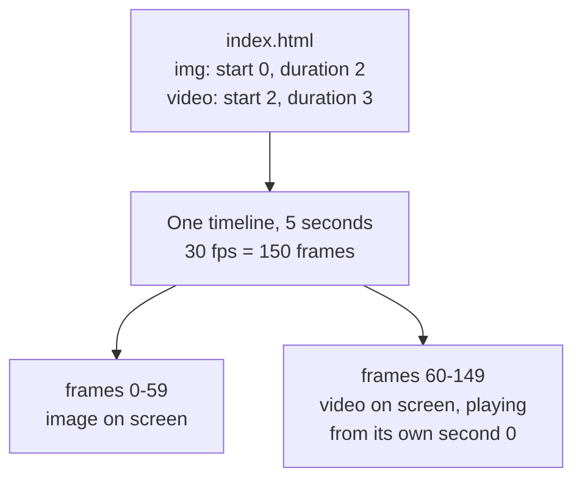

A composition is an HTML file that describes a video. You write elements, give
them `data-*` timing attributes, and the framework turns them into frames.

`index.html` is the top-level composition. It can hold other compositions
inside it. There is no special "root" type — any composition can be imported
into any other.

## How an HTML file becomes frames

Here is a whole video: a logo, then a video clip.

```html index.html
<div id="root" data-composition-id="root"
     data-start="0" data-width="1920" data-height="1080">
  
  <video class="clip" src="assets/video.mp4"
         data-start="2" data-duration="3" data-track-index="0"></video>
</div>
```

Two rules make that work. The outer element needs `data-composition-id`, and
every timed element needs `class="clip"` so the runtime can hide it outside its
own window of time.

The clips add up to five seconds. At 30 frames per second — the default — that
is 150 frames, numbered 0 to 149:



Nothing plays in real time during a render. The renderer asks for frame 0, then
frame 1, and each answer is a single still picture. That is what makes
[rendering deterministic](/concepts/determinism).

## What can go on the timeline

A clip is any element with timing attributes on it:

- `<video>` — video clips, B-roll, A-roll
- `` — stills and overlays
- `<audio>` — music and sound effects
- `<div data-composition-id="...">` — another composition nested inside this one

The [Data attributes](/concepts/data-attributes) page lists every timing
attribute. The [HTML schema](/reference/html-schema) has the full contract.

## Put one composition inside another

You can either point at a separate file or write the nested composition inline.
Use a separate file when you want to reuse it.

<Tabs>
  <Tab title="External file">
    `data-composition-src` names the file. The framework fetches it, pulls the
    content out of its `<template>` tag, mounts it, runs its scripts, and
    registers its timeline.

    Paths resolve from the **project root**, not from the file doing the
    referencing. So a composition nested one level deep still writes
    `compositions/foo.html`, never `../compositions/foo.html`.

    ```html index.html
    <div
      id="el-5"
      data-composition-id="intro-anim"
      data-composition-src="compositions/intro-anim.html"
      data-start="0"
      data-duration="4"
      data-playback-start="0"
      data-track-index="3"
    ></div>
    ```

    The file it points at wraps everything in a `<template>`:

    ```html compositions/intro-anim.html
    <template id="intro-anim-template">
      <div data-composition-id="intro-anim" data-width="1920" data-height="1080">
        <div class="title">Welcome!</div>

        <style>
          [data-composition-id="intro-anim"] .title {
            font-size: 72px; color: white; text-align: center;
          }
        </style>

        <script>
          const tl = gsap.timeline({ paused: true });
          tl.from(".title", { opacity: 0, y: -50, duration: 1 });
          window.__timelines["intro-anim"] = tl;
        </script>
      </div>
    </template>
    ```

    `data-playback-start` picks which moment of the child timeline shows first.
    It defaults to `0`. Trimming or splitting from the left pushes this offset
    forward by the time elapsed multiplied by `data-playback-rate`, so the
    nested animation keeps going instead of jumping back to its beginning.
  </Tab>
  <Tab title="Inline">
    Write the nested composition straight into the parent. Simpler for
    something you only use once.

    ```html index.html
    <div id="root" data-composition-id="root"
         data-start="0" data-width="1920" data-height="1080">

      <!-- Inline nested composition -->
      <div id="el-5" data-composition-id="intro-anim"
           data-start="0" data-track-index="3"
           data-width="1920" data-height="1080">
        <div class="title">Welcome!</div>
      </div>

      <script>
        // Timeline for the inline composition
        const introTl = gsap.timeline({ paused: true });
        introTl.from(".title", { opacity: 0, y: -50, duration: 1 });
        window.__timelines["intro-anim"] = introTl;
      </script>
    </div>
    ```

    No `<template>` tag and no `data-composition-src` here.
  </Tab>
</Tabs>

### Where the files live

<Tree>
  <Tree.Folder name="project" defaultOpen>
    <Tree.File name="index.html" />
    <Tree.Folder name="compositions" defaultOpen>
      <Tree.File name="intro-anim.html" />
      <Tree.File name="caption-overlay.html" />
      <Tree.File name="outro-title.html" />
    </Tree.Folder>
    <Tree.Folder name="assets">
      <Tree.File name="video.mp4" />
      <Tree.File name="music.mp3" />
      <Tree.File name="logo.png" />
    </Tree.Folder>
  </Tree.Folder>
</Tree>

## HTML sets the timing, scripts do the motion

Your HTML says what plays, when, and on which track, all through
[data attributes](/concepts/data-attributes). Your scripts handle the creative
part: effects, transitions, canvas, SVG, [GSAP](/guides/gsap-animation)
animation.

<Warning>
  Never use a script to play, pause, or seek a media element, and never use one
  to show or hide a clip based on time. The framework already does that from the
  data attributes, and a script doing it too will fight the framework. See
  [Common Mistakes](/guides/troubleshooting) for what that looks like.
</Warning>

## Reuse one composition with different content

One source file can appear several times in the same video, each copy carrying
its own text and colors. HyperFrames does not wire `data-var-*` attributes into
your DOM or CSS for you — you do it in three steps:

1. Declare each variable — id, type, default — on the sub-composition's root
   with `data-composition-variables`. That root is the `<html>` element in a
   full-document composition, or the `[data-composition-id]` element in a
   template or fragment.
2. Pass each copy's values on its host element with `data-variable-values`.
3. Read them inside the composition with
   `window.__hyperframes.getVariables()`, which layers the host's values over
   the declared defaults, one copy at a time.

```html index.html
<div
  data-composition-id="card-pro"
  data-composition-src="compositions/card.html"
  data-start="0"
  data-duration="3"
  data-track-index="1"
  data-variable-values='{"title":"Pro","color":"#ff4d4f"}'
></div>
<div
  data-composition-id="card-enterprise"
  data-composition-src="compositions/card.html"
  data-start="card-pro"
  data-duration="3"
  data-track-index="1"
  data-variable-values='{"title":"Enterprise","color":"#22c55e"}'
></div>
```

The second card's `data-start="card-pro"` means "start when that one ends".

And the source file both cards share:

```html compositions/card.html
<html data-composition-variables='[
  {"id":"title","type":"string","label":"Title","default":"Fallback"},
  {"id":"color","type":"color","label":"Color","default":"#111827"}
]'>
  <body>
    <div data-composition-id="card" data-width="1920" data-height="1080">
      <h1 class="title"></h1>

      <style>
        [data-composition-id="card"] .title { color: var(--card-color, #111827); }
      </style>

      <script>
        const { title, color } = __hyperframes.getVariables();
        const root = document.querySelector('[data-composition-id="card"]');
        root.querySelector(".title").textContent = title;
        root.style.setProperty("--card-color", color);
      </script>
    </div>
  </body>
</html>
```

[Variables](/concepts/variables) covers the types, the bindings that need no
script, CLI overrides, and which value wins. If you are building tooling on
`@hyperframes/core`, `extractCompositionMetadata()` reads the same
`data-composition-variables` array — that is how Studio builds its editing UI.

## See every composition in a project

```bash
npx hyperframes compositions
```

## Related topics

- [Data attributes](/concepts/data-attributes)
- [Deterministic rendering](/concepts/determinism)
- [Variables](/concepts/variables)
- [Animate with GSAP](/guides/gsap-animation)
- [HTML schema reference](/reference/html-schema)
- [Start from an example](/examples)
