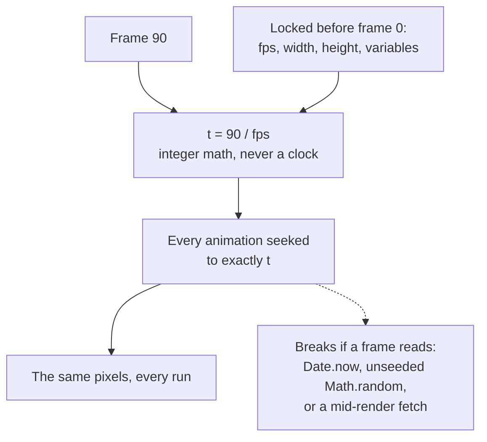

The same [composition](/concepts/compositions) always produces the same video.
That is the guarantee everything else rests on — it is why automated pipelines,
CI tests, and AI-driven editing can be trusted.

## Why the same frame always comes out the same

Rendering never plays your video. It asks for one frame at a time, and the
answer to "what does frame 90 look like?" depends on exactly one thing that
changes: the number 90.



So the rules are short:

- **No wall clock.** No `Date.now()`, no `requestAnimationFrame`, no system
  timers.
- **No unseeded randomness.** `Math.random()` without a seed gives a different
  frame every run.
- **No fetching mid-render.** Every asset loads before the first frame.
- **Fixed output size.** `fps`, `width`, and `height` are locked before frame 0.
- **A finite length.** Every composition has a known end.

## What happens on each frame

<Steps>
  <Step title="Frame clock">
    The [engine](/packages/engine) works out the time with integer math:
    `time = floor(frame) / fps`. Real time is never consulted.
  </Step>
  <Step title="Seek">
    The [frame adapter](/concepts/frame-adapters) gets `seekFrame(frame)` and
    moves every animation, DOM change, and canvas draw to that exact moment. All
    [GSAP](/guides/gsap-animation) timelines are paused and seeked, never played.
  </Step>
  <Step title="Capture">
    Chrome's `HeadlessExperimental.beginFrame` grabs the pixels in one atomic
    operation. No half-painted frames.
  </Step>
  <Step title="Encode">
    FFmpeg turns the captured frames into the MP4 and mixes in the audio from
    your `<audio>` and `<video>` elements.
  </Step>
</Steps>

Every [frame adapter](/concepts/frame-adapters) follows these same rules. If you
write your own, it must follow the
[determinism contract](/concepts/frame-adapters#contract):
`seekFrame(frame)` gives the same result for the same frame, seeks work in any
order, nothing resolves after the frame is committed, and the lifecycle stays
`init` → `seekFrame` (many times) → `destroy`.

## Rule out your machine as a variable

Fonts and Chrome versions differ between computers, so a local render can shift
by a pixel from one machine to the next. Render in Docker when you need exact
reproducibility:

```bash
npx hyperframes render --docker --output output.mp4
```

Docker pins the Chromium version, the font set, and the FFmpeg encoder, so the
platform stops being an input. The [Rendering guide](/guides/rendering) covers
every other option.

## Will the preview match the render?

Every frame looks the same in both, because both run the same
`hyperframe.runtime`, the [producer's](/packages/producer) seek behavior is the
single source of truth, and the `__playerReady` and `__renderReady` gates hold
capture until the composition is fully loaded.

Speed is a different story. Preview plays in real time in your browser, so it is
limited by your hardware. Render is seek-driven and takes one frame at a time,
so it never drops a frame no matter how expensive that frame is. A composition
that stutters in preview still renders perfectly — see
[Performance](/guides/performance).

## Related topics

- [Frame adapters](/concepts/frame-adapters)
- [Render to MP4](/guides/rendering)
- [Compositions](/concepts/compositions)
- [@hyperframes/producer](/packages/producer)
- [Common mistakes that break determinism](/guides/troubleshooting)
