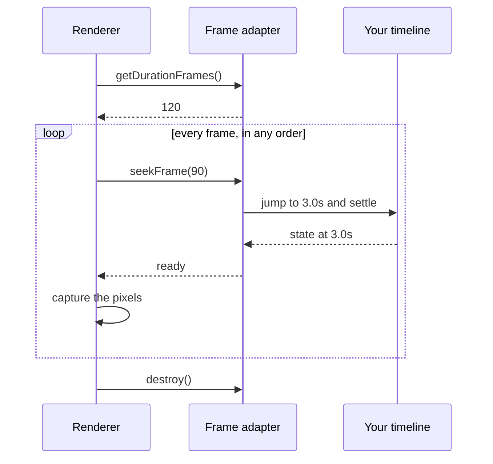

<Info>
  The exported `FrameAdapter` interface is experimental v0 API. Its signatures
  may change before v1.
</Info>

A frame adapter answers one question: what state should an animation have at frame N?

Most composition authors do not implement this interface. HyperFrames already seeks registered GSAP, CSS, Anime.js, Lottie, Three.js, Web Animations, and TypeGPU animation through its browser runtime. Use the [GSAP guide](/guides/gsap-animation) for the normal authoring path.

Use `FrameAdapter` when you are building a custom host around a seekable animation object.

Rendering never plays the animation. It asks for one frame, waits, captures it,
then asks for the next — so the same frame always comes out the same.



## Interface

```ts
import type { FrameAdapter, FrameAdapterContext } from "@hyperframes/core";

type FrameAdapter = {
  id: string;
  init?: (context: FrameAdapterContext) => Promise<void> | void;
  getDurationFrames: () => number;
  seekFrame: (frame: number) => Promise<void> | void;
  destroy?: () => Promise<void> | void;
};
```

The context contains the composition ID, frame rate, dimensions, and optional root element.

## Adapt a GSAP timeline

`@hyperframes/core` includes a helper for a GSAP-like timeline:

```ts
import { createGSAPFrameAdapter } from "@hyperframes/core";

const adapter = createGSAPFrameAdapter({
  id: "intro",
  fps: 30,
  timeline,
});

await adapter.init?.({
  compositionId: "intro",
  fps: 30,
  width: 1920,
  height: 1080,
});

await adapter.seekFrame(90); // three seconds
```

The helper pauses the timeline, derives its frame length, and converts each frame request to seconds.

## Contract

A custom adapter must:

- return a finite, non-negative frame count;
- support forward, backward, and random seeks;
- return the same state when the same frame is requested again;
- avoid wall-clock timers and unseeded randomness;
- finish asynchronous work before the frame is captured;
- release listeners and other resources in `destroy()`.

The host still owns the capture and encoding pipeline. The adapter owns only the animation state.

## Continue

Read [Deterministic rendering](/concepts/determinism) for the timing rules or [`@hyperframes/core`](/packages/core) for the package exports.
